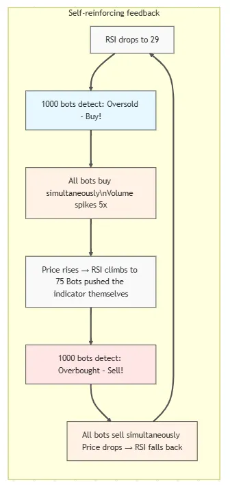

# 🤖 Second-Order Chaos: How Algo Trading Bots Play Against Themselves at a Loss


I build trading systems for crypto and discovered a paradox that explains why 95% of bots blow their accounts. The problem isn't the strategies — it's that thousands of copies of the same algorithm trade against each other.

## First-Order vs Second-Order Chaos

Let's define terms.

**First-order chaos** — the market is unpredictable, but participants don't know the patterns. You can find edge through analysis. Classic indicators work.

**Second-order chaos** — the market is unpredictable BECAUSE everyone knows the patterns. Everyone trades the same way. Bots react to bots. Strategies CREATE the noise they're trying to trade.

We're living in the second one now.

## One Algorithm Against Itself

Here's what happens every second on crypto exchanges:

```
09:00:00.000 - BTC price drops to $87,300
09:00:00.050 - 1000 freqtrade bots see: RSI < 30

Each bot thinks:

"RSI in oversold zone → this is a buy signal"
09:00:00.100 - All simultaneously send BUY orders
09:00:00.150 - Price spikes to $87,450 (they all bought from each other)
09:00:00.200 - RSI instantly jumps to 75

The same bots:

"RSI in overbought zone → this is a sell signal"
09:00:00.250 - All simultaneously send SELL orders
09:00:00.300 - Price back to $87,300
```

Final score:

- Each bot: -0.1% (spread) -0.04% (fees) = **-0.14%**
- Exchange: +0.04% × 1000 = **+40 USD**

**These aren't different bots competing. This is literally one algorithm playing against itself at a loss.**

## Why This Happens

Look at a typical strategy from the freqtrade tutorial:

```python
class RSIStrategy(IStrategy):
    def populate_indicators(self, dataframe, metadata):
        dataframe['rsi'] = ta.RSI(dataframe, timeperiod=14)
        return dataframe
    
    def populate_entry_trend(self, dataframe, metadata):
        dataframe.loc[
            (dataframe['rsi'] < 30),  # Oversold
            'enter_long'] = 1
        return dataframe
    
    def populate_exit_trend(self, dataframe, metadata):
        dataframe.loc[
            (dataframe['rsi'] > 70),  # Overbought
            'exit_long'] = 1
        return dataframe
```

This strategy:

1. Published in official documentation
2. Copied into thousands of bots
3. Runs on the same timeframes (5m, 15m)
4. Uses identical parameters (RSI 14, thresholds 30/70)

Result: **thousands of identical instances** of one code trading on the same market.

## The Math of Self-Conflict

Let's break it down with real numbers:

```
Conditions:

- 1000 bots with identical RSI strategy
- Each trading 0.01 BTC
- Spread: 0.05%
- Commission: 0.04% (taker)

"RSI reversal" scenario:
1. RSI drops to 29
2. All 1000 bots send BUY 0.01 BTC
3. Total volume: 10 BTC bought in 100ms
4. Price rises 0.15% from impact
5. RSI jumps to 72 (bots raised it themselves)
6. All 1000 bots send SELL 0.01 BTC
7. Price drops 0.15% back

PnL per bot:

- Entry: bought 0.05% above mid (spread)
- Exit: sold 0.05% below mid (spread)
- Fees: 0.04% × 2 = 0.08%
- Price impact: ~0% (canceled out)
- Total: -0.18% per round-trip

Over 100 such cycles per day:

- Each bot: -18% per day
- Exchange: +0.08% × 1000 × 100 = +8000 USD per day
```

## But My Bot Uses Different Indicators!

No, it doesn't. Here's what 90% of retail bots use:

| Indicator | Usage |
|-----------|-------|
| RSI | 85% |
| MACD | 78% |
| Bollinger Bands | 65% |
| EMA/SMA crosses | 72% |
| Volume | 45% |

Bots combine these indicators, but combinations are also standard:

- RSI + MACD = most popular
- BB + RSI = second most popular
- EMA cross + Volume = third

**You're not unique. Your "secret" strategy is copy-paste from the top 5 tutorials.**

## Predictable Stop-Losses

Another pain point — stop placement. 90% of bots use:

```python
stoploss = -0.10  # Fixed 10%
# or
stoploss = atr * 1.5  # ATR-based
# or
stoploss = last_swing_low - 0.5%  # Structure-based
```

Market makers see these stop clusters and hunt them:

```
Typical situation:

1. Price: $87,500
2. Bots entered LONG on "breakout" at $87,450
3. Stops: $87,450 - ATR(1.5) ≈ $87,280
4. Market maker sees: cluster stop orders @ $87,280-$87,300
5. Pushes price to $87,275
6. Stops trigger = selling cascade
7. Buys cheaper @ $87,250
8. Price returns to $87,400

Bots: -1.5% each
Market maker: +0.3%
```

## Self-Reinforcing Feedback Loop

Here's the full picture of what happens:



## What To Do: LLM Instead of Indicators

I use [backtest-kit](https://github.com/tripolskypetr/backtest-kit) with Ollama for signal generation. LLM analyzes context holistically instead of jerking on every line crossing.

## Signal Schema

```typescript
import { str } from "functools-kit";
import { z } from "zod";

export const SignalSchema = z.object({
  position: z
    .enum(["long", "short", "wait"])
    .describe(
      str.newline(
        "Position direction (ALWAYS required):",
        "long: market shows aligned bullish signals",
        "short: market shows aligned bearish signals",
        "wait: conflicting signals between timeframes"
      )
    ),
  description: z
    .string()
    .describe(
      str.newline(
        "Professional recommendation in ONE LINE:",
        "For LONG: strategy, reason, plan (buy → sell higher)",
        "For SHORT: strategy, reason, plan (sell → buy lower)",
        "For WAIT: why and when to enter"
      )
    ),
  reasoning: z
    .string()
    .describe(
      str.newline(
        "Technical justification (4-6 sentences):",
        "Signal alignment across timeframes",
        "Volume quality and dynamics",
        "Momentum, slope, hidden divergences",
        "Key support and resistance levels",
        "REQUIRED: TP/SL level selection with technical justification"
      )
    ),
  price_open: z.number().describe("Entry price in USD"),
  price_stop_loss: z.number().describe(
    str.newline(
      "Stop-loss price in USD",
      "For LONG: below price_open",
      "For SHORT: above price_open",
      "NEVER set SL without technical justification"
    )
  ),
  price_take_profit: z.number().describe(
    str.newline(
      "Take-profit price in USD",
      "For LONG: above price_open",
      "For SHORT: below price_open"
    )
  ),
  minute_estimated_time: z.number().describe(
    str.newline(
      "Time to reach TP in minutes",
      "Based on ATR, ADX, MACD, Momentum"
    )
  ),
  risk_note: z
    .string()
    .describe(
      str.newline(
        "Risk description (ALWAYS required):",
        "1. Whale manipulation (fake breakouts, pin bars)",
        "2. Order book (walls, spoofing, imbalance)",
        "3. Time factors (session, liquidity)",
        "4. Technical risks (divergences, weak volume)",
        "Provide SPECIFIC numbers and probabilities"
      )
    ),
});
```

## Signal Generation Prompt

```typescript
import { str } from "functools-kit"

const SIGNAL_PROMPT = str.newline(
  "Analyze the market using attached data.",
  "Minimum profit percentage at TP: 1%",
  "Risk Reward ratio: no higher than 1:2",
  "",
  "Requirements:",
  "- 1m timeframe, next three hours",
  "- Recommendation for both uptrend AND downtrend",
  "- Entry conditions as IF-THEN with price levels",
  "- Entry/Stop/TP as numbers in USD",
  "- Filters required",
  "- Risk management at the end",
  "- No data retelling",
  "- Maximum compression",
  "",
  "Format:",
  "LONG conditions: [logic with Support/Resistance]",
  "Entry: [USD], TP: [USD], SL: [USD]",
  "",
  "SHORT conditions: [logic with Support/Resistance]",
  "Entry: [USD], TP: [USD], SL: [USD]",
  "",
  "Filters: [list]",
  "Risk: [rules]"
);
```

## Strategy

```typescript
import { json } from "agent-swarm-kit";
import { addStrategy } from "backtest-kit";

addStrategy({
  strategyName: "llm-anti-bot",
  interval: "5m",
  riskList: [
    "TakeProfitDistanceRisk",
    "RiskRewardRatioRisk",
    "LanguageModelOpinionRisk",
  ],
  getSignal: async (symbol) => {
    const { data, resultId, error } = await json(
      "SignalOutline",
      symbol
    );
    
    if (error) throw new Error(error);
    if (data.position === "wait") return null;
    
    return {
      id: resultId,
      position: data.position,
      minuteEstimatedTime: +data.minute_estimated_time,
      priceStopLoss: +data.price_stop_loss,
      priceTakeProfit: +data.price_take_profit,
      priceOpen: +data.price_open,
      note: data.risk_note,
    };
  },
});
```

## Preparing History for LLM

```typescript
import { Cache } from "backtest-kit";
import { str, trycatch } from "functools-kit";

const fetchHourHistory = Cache.fn(
  lib.hourCandleHistoryService.getReport,
  { interval: "30m" }
);
const fetchFifteenMinuteHistory = Cache.fn(
  lib.fifteenMinuteCandleHistoryService.getReport,
  { interval: "5m" }
);

const commitHourHistory = trycatch(
  async (symbol: string, history: History) => {
    const hourHistory = await fetchHourHistory(symbol);
    await history.push(
      {
        role: "user",
        content: str.newline(
          "=== 1-HOUR CANDLES (last 6 candles) ===",
          "",
          hourHistory
        ),
      },
      {
        role: "assistant",
        content: "1-hour candles received.",
      }
    );
  },
  { fallback: () => Cache.clear(fetchHourHistory) }
);

const commitFifteenMinuteHistory = trycatch(
  async (symbol: string, history: History) => {
    const data = await fetchFifteenMinuteHistory(symbol);
    await history.push(
      {
        role: "user",
        content: str.newline(
          "=== 15-MINUTE CANDLES (last 8 candles) ===",
          "",
          data
        ),
      },
      {
        role: "assistant",
        content: "15-minute candles received.",
      }
    );
  },
  { fallback: () => Cache.clear(fetchFifteenMinuteHistory) }
);
```

## Indicator Calculation Service (excerpt)

```typescript
import {
  FasterRSI as RSI,
  FasterMACD as MACD,
  FasterBollingerBands as BollingerBands,
  FasterATR as ATR,
  FasterADX as ADX,
  // ... other indicators
} from "trading-signals";

function generateAnalysis(symbol: string, candles: ICandleData[]) {
  const rsi = new RSI(14);
  const macd = new MACD(new EMA(12), new EMA(26), new EMA(9));
  const bollinger = new BollingerBands(20, 2.0);
  const atr14 = new ATR(14);
  const adx = new ADX(14);
  // ... initialize other indicators
  const results: ILongTermRow[] = [];
  candles.forEach((candle, i) => {
    const { high, low, close } = candle;
    // Update all indicators
    rsi.update(close, false);
    macd.update(close, false);
    bollinger.update(close, false);
    atr14.update({ high, low, close }, false);
    adx.update({ high, low, close }, false);
    // Skip until indicators are warmed up
    if (i < WARMUP_PERIOD) return;
    // Volume trend: compare SMA(6) of current and previous period
    const volumeTrend = calculateVolumeTrend(volumes, i);
    // Support/Resistance: min/max over last N candles
    const { support, resistance } = calculatePivots(highs, lows, i);
    // Fibonacci: nearest level to current price
    const fibonacciNearest = calculateFibonacciLevels(candles, i);
    results.push({
      symbol,
      rsi14: rsi.getResult(),
      macd12_26_9: macd.getResult()?.macd,
      adx14: adx.getResult(),
      atr14: atr14.getResult(),
      support,
      resistance,
      fibonacciNearestLevel: fibonacciNearest.level,
      // ... remaining fields
    });
  });
  return results;
}
```

## Validations

```typescript
import { addOutline, dumpOutlineResult } from "agent-swarm-kit";
import { zodResponseFormat } from "openai/helpers/zod";

addOutline({
  outlineName: "SignalOutline",
  completion: "OllamaCompletion",
  format: zodResponseFormat(SignalSchema, "position_open_decision"),
  getOutlineHistory: async ({ history, param: symbol }) => {
    await commitHourHistory(symbol, history);
    await commitFifteenMinuteHistory(symbol, history);
    // ... other timeframes
  },
  validations: [
    {
      validate: ({ data }) => {
        if (data.position === "long") {
          if (data.price_stop_loss >= data.price_open) {
            throw new Error("LONG: SL must be below entry");
          }
          if (data.price_take_profit <= data.price_open) {
            throw new Error("LONG: TP must be above entry");
          }
        }
      },
      docDescription: "Validates price correctness for LONG",
    },
    {
      validate: ({ data }) => {
        if (data.position === "short") {
          if (data.price_stop_loss <= data.price_open) {
            throw new Error("SHORT: SL must be above entry");
          }
          if (data.price_take_profit >= data.price_open) {
            throw new Error("SHORT: TP must be below entry");
          }
        }
      },
      docDescription: "Validates price correctness for SHORT",
    },
    {
      validate: ({ data }) => {
        if (data.position !== "wait" && data.minute_estimated_time > 360) {
          throw new Error("Time to TP > 6 hours. Use wait");
        }
      },
      docDescription: "Validates time realism",
    },
  ],
  callbacks: {
    async onValidDocument(result) {
      await dumpOutlineResult(result);
    },
  },
});
```

## Why LLM Works Better

LLM doesn't jerk on every RSI < 30. It sees context:

```
RSI 1m: 28 (oversold)
RSI 1h: 55 (neutral)
Volume: 0.3x average (weak)
ADX: 15 (no trend)
```

A standard bot would see RSI < 30 and buy. LLM understands it's a trap.

```
LLM output: "WAIT - RSI oversold on 1m, but 1h neutral, 
volume weak. These are bots trying to buy, not real 
capitulation. Wait for breakout with volume or 1h correction."
```

## Conclusion

Algo trading in crypto has become a game where thousands of copies of the same code trade against each other. Every bot pays fees, every bot loses on spread, the only beneficiary is the exchange.

If your strategy is RSI/MACD/BB from a tutorial, you're trading against 10,000 identical bots with the same code.

Edge exists, but it's elsewhere:

- In understanding bot crowd behavior
- In using LLM for holistic analysis instead of dumb triggers
- In validating signals before execution
- Or in exiting this game entirely
