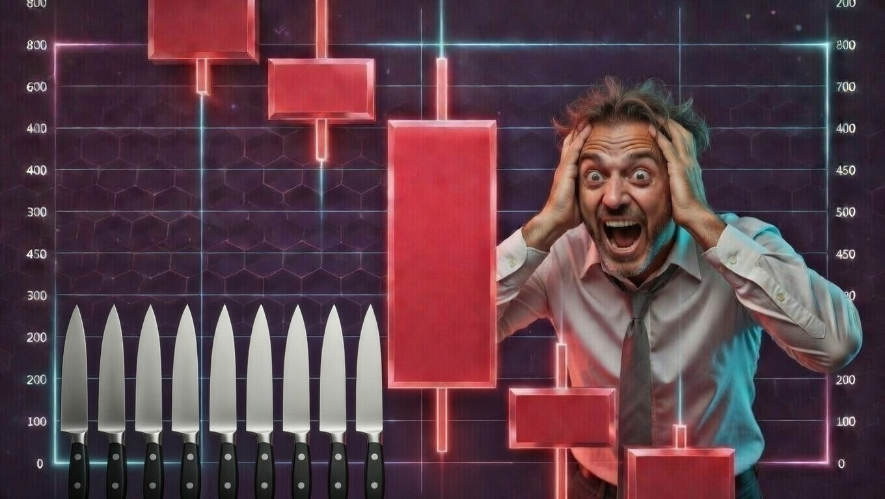
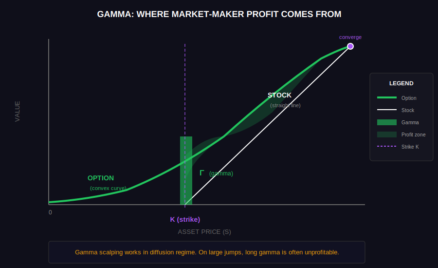
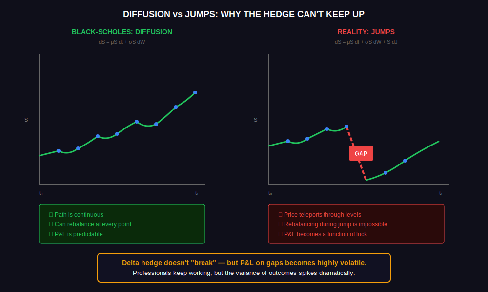
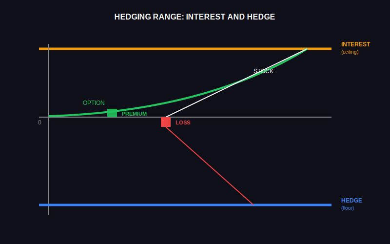
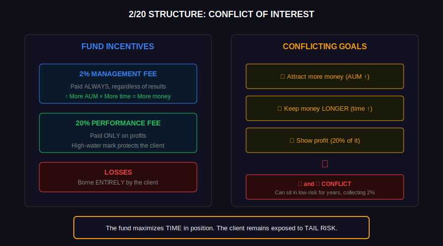
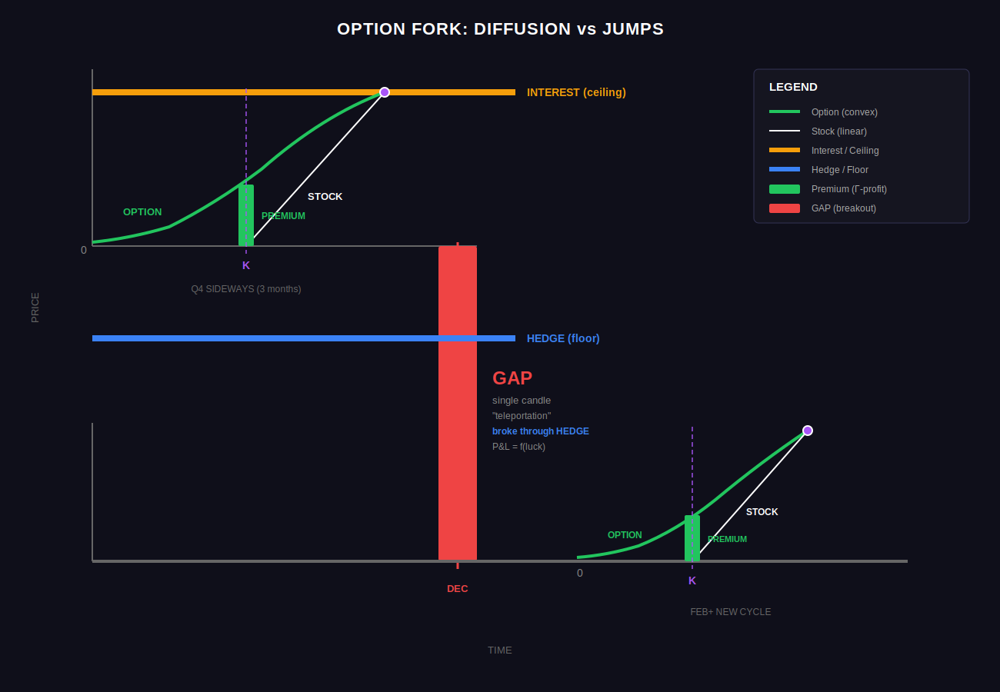
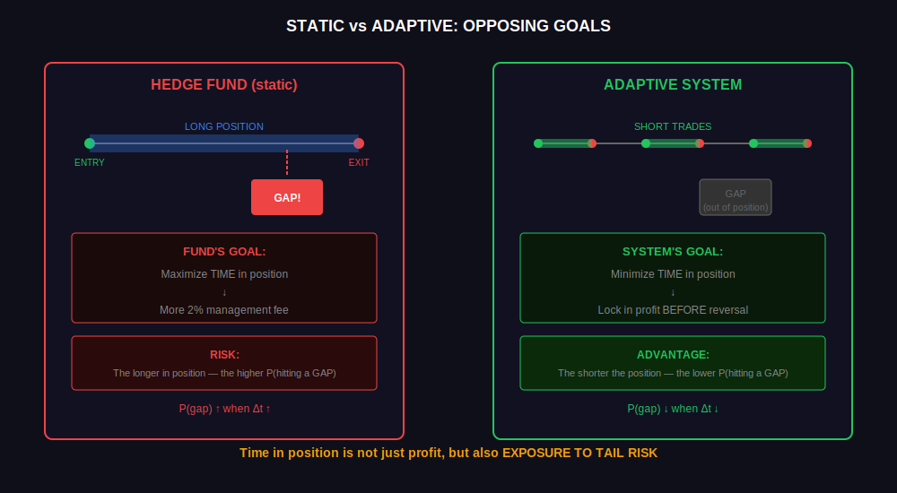
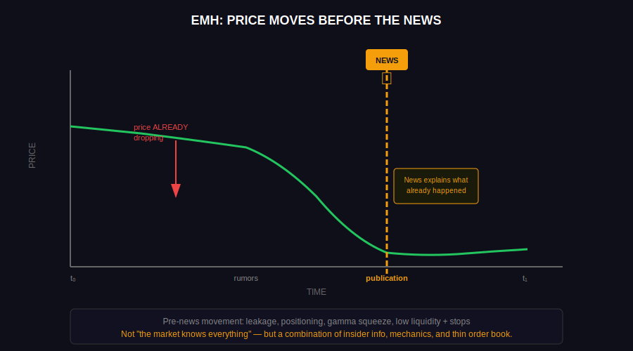
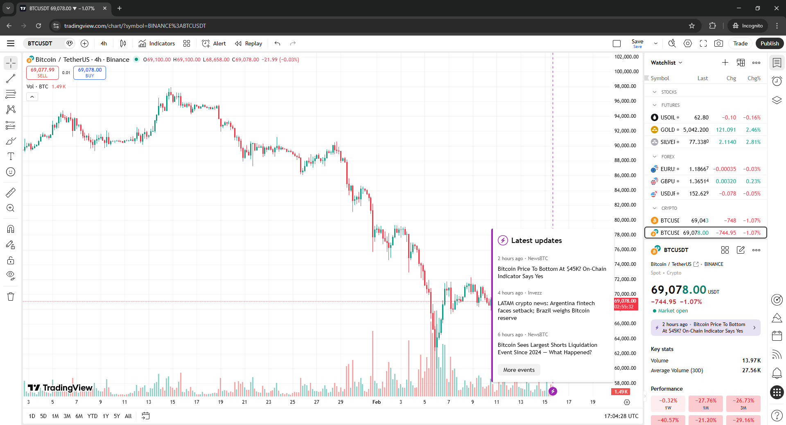

# Why the Price Drops in a Single Candle



In 2026, "buy and hold" is a bet that you can endure a -40…-70% drawdown without an emotional or margin-triggered exit. The market has become fragile: liquidation cascades happen several times a year. Static holding no longer works.

## What Are Options



If you bought a stock for $100 and it went up 10%, you have +$10 — simple and linear. Options work differently. An option is an obligation to sell a stock later at a fixed price. Their price changes **unevenly**: sometimes slowly, sometimes very sharply. This "curvature" is the key feature. The further away from expiration, the more curvature is "accumulated." Closer to expiration it vanishes — time works against the holder.

## Smooth Movement vs. Sudden Jumps



Most textbook models assume that a stock's price changes in very small steps — continuously, with no teleportation. Reality is different: the price suddenly **drops**. During such a jump, adjusting the position is impossible — there were no trades at intermediate prices. Therefore, the outcome during a gap depends more on luck than on the quality of your strategy.

## How Positions Are Adjusted



There are two major client groups:

**First group** — pension funds and banks.
They buy put options to report nicely to management/depositors: "yes, the market fell, but we have protection, losses are unrealized."

**Second group** — company investors.
They buy products like "protected growth": if the market rises significantly — you get a share of the profit; if it falls — you lose nothing (at least on paper).

**This creates a fork** — if the price rises, we buy at a better price. If the price falls, we have a SHORT open from another investor.

## Conflict of Interest



Hedge fund economics create a specific incentive structure.

**A hedge fund does not guarantee loss coverage.**

**2% management fee** — collected regardless of results, even if the client is at a loss
**20% performance fee** — only on profits (usually with a high-water mark)
**Losses** — borne entirely by the client

The first part (2% of AUM) is a "salary for time." The longer the money stays in the fund and the larger the AUM, the greater the guaranteed income.

**The fund benefits from:**

1. Attracting more money (more AUM → more 2%)
2. Keeping money longer (2% accrues every year)
3. Showing profit (earning 20% of it)

Goals 2 (keep longer) and 3 (generate profit) conflict. A fund can hold low-risk positions for years, collect 2%, and not chase performance fees. Many do exactly that.

This creates a mismatch: the fund benefits from long holding periods, while the client's capital remains exposed to tail risk.

## How Cascades and "Sudden" Crashes Occur



When many participants are forced to close positions simultaneously, the price starts moving on its own, amplifying the pressure. One large gap → hedge can't keep up → big loss → even more forced selling → even larger gap. This is how famous crashes happened: 2008, March 2020, and dozens of smaller episodes.

## How to Protect Against a Drop

To reduce the probability of being caught in a GAP, you need to minimize the time capital stays in a position.



## The Compromise

To balance between holding time and stock returns, one could monitor market sentiment.

1. No authorities: Market sentiment is shaped not by one blogger's posts, but by a sample of posts shown to all visitors by the recommendation algorithm.
2. No de-anonymization: There is no way to distinguish 10 rephrased posts with one opinion from one person from 10 posts with different opinions from different people.



According to the efficient market hypothesis from Eugene Fama's work, Japanese candlesticks already incorporate the market's reaction to news. The thing is, traders buy on rumors and sell on news. You can verify this in practice by opening TradingView after a news event: the lightning bolt icon (Latest News) always shows a preceding sustained price movement of many points.



## What Should an Individual Do

Instead of long-term holding — an adaptive system:

1. Take a strategy skeleton with specific entry logic
2. Run a backtest on fresh data (rolling window)
3. AI analyzes execution logs: where signals worked, where they didn't
4. Modify parameters based on regime detection
5. Repeat

## Example Skeleton:

- Determine direction on the 4H timeframe
- Wait for a common retail signal on 15M (where the algo flow enters)
- If the 15M signal aligns with the 4H direction — check the volatility forecast
- Use realized volatility models (GARCH variants, HAR-RV) with the QLIKE criterion for selection
- If σ > threshold covering commissions and slippage — enter
- R:R 1:1, scale exit after breakeven

## Code Examples:

Over a long time horizon, this won't converge to 50/50 with a zero-sum and no profit under the efficient market hypothesis: any public information (including patterns, indicators, signals) is already priced in. If RSI oversold "works," then arbitrageurs will buy before RSI reaches 30, diluting the signal.

The key point: you need to cut backtest strategy time to zero through self-reinforcement runtime, since the bet is on temporary inefficiencies and regime adaptation.

The adaptive cycle has no "done" state — parameters are recalculated on each iteration for the current market regime.

**Volatility filter (GARCH):**

```javascript
import { predict } from 'garch'; // https://www.npmjs.com/package/garch
import { getCandles } from 'backtest-kit'; // https://www.npmjs.com/package/backtest-kit

const candles = await getCandles(symbol, '15m', 300);
const { sigma, reliable, upperPrice, lowerPrice } = predict(candles, '15m');

// sigma - expected price movement (0.012 = 1.2%)
// reliable - whether the model converged
// upperPrice / lowerPrice - +-1 sigma corridor for the next candle

if (!reliable) return null;  // model doesn't fit the data
if (sigma < 0.01) return null;  // movement < 1%, won't cover fees and slippage

// use upperPrice and lowerPrice as TP/SL
return { upperPrice, lowerPrice }
```

**JavaScript integration:**

```javascript
import {
  addExchangeSchema,
  addStrategySchema,
  addActionSchema,
  Cache,
  Constant,
  commitPartialProfit,
  getCandles,
} from "backtest-kit";

import { extract, run, toSignalDto, File } from "@backtest-kit/pinets";
import { predict } from 'garch';

const getPlotHigher = Cache.fn(
  async (symbol) => {
    return await run(File.fromPath("timeframe_4h.pine"), {
      symbol,
      timeframe: "4h",
      limit: 100,
    });
  },
  { interval: "4h", key: ([symbol]) => symbol },
);

const getDataHigher = async (symbol) => {
  const plots = await getPlotHigher(symbol);
  return extract(plots, {
    allowLong: "AllowLong",
    allowShort: "AllowShort",
    allowBoth: "AllowBoth",
    noTrades: "NoTrades",
  });
};

const getPlotLower = Cache.fn(
  async (symbol) => {
    return await run(File.fromPath("timeframe_15m.pine"), {
      symbol,
      timeframe: "15m",
      limit: 100,
    });
  },
  {
    interval: "15m",
    key: ([symbol]) => `${symbol}`,
  },
);

const getDataLower = async (symbol) => {
  const plots = await getPlotLower(symbol);
  return extract(plots, {
    position: "Signal",
    priceOpen: "Close",
    priceTakeProfit: "TakeProfit",
    priceStopLoss: "StopLoss",
    minuteEstimatedTime: "EstimatedTime",
  });
};

addStrategySchema({
  strategyName: "main_strategy",
  interval: "5m",
  getSignal: async (symbol) => {
    const data_higher = await getDataHigher(symbol);

    if (data_higher.noTrades) {
      return null;  // ADX < 25, sideways market
    }

    const data_lower = await getDataLower(symbol);

    if (data_lower.position === 0) {
      return null;  // no signal
    }

    // Filter: don't enter against the higher timeframe
    if (data_higher.allowShort && data_lower.position === 1) {
      return null;
    }
    if (data_higher.allowLong && data_lower.position === -1) {
      return null;
    }

    const {
      upperPrice,
      lowerPrice
    } = predict(
      await getCandles(symbol, '15m', 300),
      '15m'
    );

    // Long: TP = upperPrice, SL = lowerPrice
    // Short: TP = lowerPrice, SL = upperPrice
    const isLong = data_lower.position === 1;
    const tp = isLong ? upperPrice : lowerPrice;
    const sl = isLong ? lowerPrice : upperPrice;

    const signal = await toSignalDto(signalId, data_lower, null);

    Object.assign(signal, {
      priceTakeProfit: tp,
      priceStopLoss: sl,
    });

    return signal;
  },
});
```

**Position management:**

```javascript
addActionSchema({
  actionName: "partial_profit_action",
  handler: class {
    async partialProfitAvailable({ symbol, level }) {
      if (level === Constant.TP_LEVEL3) {
        await commitPartialProfit(symbol, 33);
      }
      if (level === Constant.TP_LEVEL2) {
        await commitPartialProfit(symbol, 33);
      }
      if (level === Constant.TP_LEVEL1) {
        await commitPartialProfit(symbol, 34);
      }
    }
  },
});

addActionSchema({
  actionName: "breakeven_action",
  handler: class {
    async breakevenAvailable({ symbol, currentPrice }) {
      // Tighten trailing stop after breakeven
      await commitTrailingStop(symbol, -3, currentPrice);
    }
  }
});
```

Staged exit: 33% at each TP level. This locks in profit before a reversal. After breakeven — tighten the SL to protect accumulated gains.
