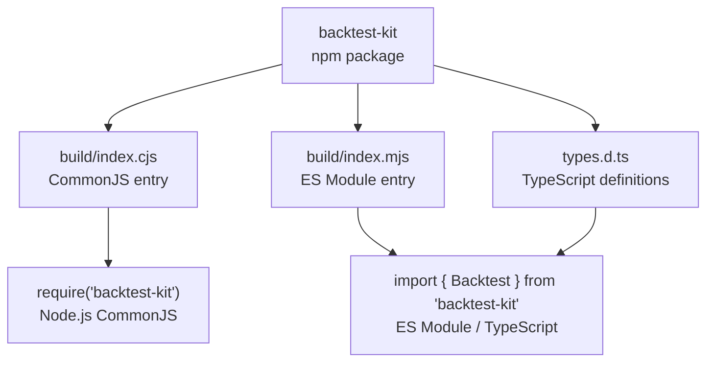
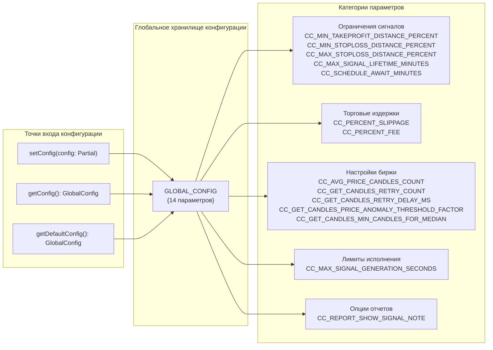
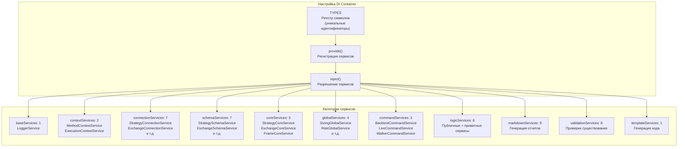

# Начало работы с Backtest-Kit

Добро пожаловать в руководство по началу работы с фреймворком backtest-kit! Это руководство поможет вам установить фреймворк, настроить окружение и подготовиться к созданию ваших первых торговых стратегий.

## Что такое Backtest-Kit?

Backtest-Kit - это мощный фреймворк для создания, тестирования и запуска торговых стратегий на криптовалютных рынках. Он предоставляет:

- **Бэктестинг** - тестирование стратегий на исторических данных
- **Живую торговлю** - реальное исполнение стратегий с защитой от сбоев
- **Сравнение стратегий** - автоматическое сравнение нескольких стратегий
- **AI-оптимизацию** - генерацию стратегий с помощью больших языковых моделей

---

## Системные требования

Перед установкой убедитесь, что у вас установлено:

| Требование | Версия | Назначение |
|------------|---------|------------|
| **Node.js** | ≥15.0.0 | JavaScript runtime (требуется для ccxt) |
| **TypeScript** | ^5.0.0 | Проверка типов и компиляция |
| **npm** или **yarn** | Последняя стабильная | Менеджер пакетов |

**Опциональные требования:**

| Требование | Версия | Назначение |
|------------|---------|------------|
| **Ollama** | ≥0.6.3 | Локальный LLM сервер для режима оптимизации |

---

## Установка

### Шаг 1: Установка базового пакета

Создайте новый проект и установите backtest-kit:

```bash
mkdir my-trading-bot
cd my-trading-bot
npm init -y
npm install backtest-kit
```

Пакетный менеджер автоматически установит основные зависимости:

```json
{
  "di-kit": "^1.0.18",
  "di-scoped": "^1.0.20",
  "functools-kit": "^1.0.94",
  "get-moment-stamp": "^1.1.1",
  "ollama": "^0.6.3"
}
```

### Шаг 2: Установка адаптера биржи

Для получения рыночных данных установите библиотеку ccxt:

```bash
npm install ccxt
```

Библиотека `ccxt` предоставляет адаптеры для более 100 криптовалютных бирж со стандартизированными API для получения исторических данных.

### Шаг 3: Опциональные зависимости

Для генерации стратегий с помощью LLM:

```bash
npm install ollama uuid
```

Для управления переменными окружения:

```bash
npm install --save-dev dotenv-cli
```

---

## Поддержка модульных систем

Фреймворк поддерживает как CommonJS, так и ES Modules:



**TypeScript проекты** автоматически используют ESM точку входа с полными определениями типов.

---

## Настройка TypeScript

Создайте файл `tsconfig.json` с минимальной конфигурацией:

```json
{
  "compilerOptions": {
    "target": "ES2020",
    "module": "ESNext",
    "moduleResolution": "node",
    "esModuleInterop": true,
    "strict": true,
    "skipLibCheck": true
  }
}
```

В `package.json` добавьте поддержку ES Module:

```json
{
  "name": "my-trading-bot",
  "version": "1.0.0",
  "type": "module",
  "scripts": {
    "start": "node ./src/index.mjs"
  }
}
```

---

## Инициализация фреймворка

### Настройка логгера

Фреймворк выводит сообщения через настраиваемый интерфейс логгера. По умолчанию логи отключены. Для получения логов предоставьте свою реализацию:

```typescript
import { setLogger } from 'backtest-kit';

setLogger({
  log: (topic, ...args) => console.log(`[LOG] ${topic}:`, ...args),
  debug: (topic, ...args) => console.debug(`[DEBUG] ${topic}:`, ...args),
  info: (topic, ...args) => console.info(`[INFO] ${topic}:`, ...args),
  warn: (topic, ...args) => console.warn(`[WARN] ${topic}:`, ...args),
});
```

### Глобальная конфигурация

Фреймворк предоставляет 14 настраиваемых параметров через `GLOBAL_CONFIG`:



**Пример базовой конфигурации:**

```typescript
import { setConfig } from 'backtest-kit';

setConfig({
  // Увеличить проскальзывание для низколиквидных рынков
  CC_PERCENT_SLIPPAGE: 0.2,

  // Снизить комиссию для VIP уровня
  CC_PERCENT_FEE: 0.05,

  // Продлить таймаут отложенных сигналов до 2 часов
  CC_SCHEDULE_AWAIT_MINUTES: 120,

  // Показывать заметки сигналов в markdown отчетах
  CC_REPORT_SHOW_SIGNAL_NOTE: true,
});
```

### Справочник параметров конфигурации

| Параметр | Тип | По умолчанию | Описание |
|----------|-----|--------------|----------|
| `CC_SCHEDULE_AWAIT_MINUTES` | `number` | - | Максимальное время ожидания активации отложенных сигналов |
| `CC_AVG_PRICE_CANDLES_COUNT` | `number` | 5 | Количество свечей для расчета VWAP |
| `CC_PERCENT_SLIPPAGE` | `number` | 0.1 | Проскальзывание на транзакцию (%) |
| `CC_PERCENT_FEE` | `number` | 0.1 | Торговая комиссия на транзакцию (%) |
| `CC_MIN_TAKEPROFIT_DISTANCE_PERCENT` | `number` | 0.5 | Минимальное расстояние TP от входа (%) |
| `CC_MIN_STOPLOSS_DISTANCE_PERCENT` | `number` | 0.5 | Минимальное расстояние SL от входа (%) |
| `CC_MAX_STOPLOSS_DISTANCE_PERCENT` | `number` | 20.0 | Максимальное расстояние SL от входа (%) |
| `CC_MAX_SIGNAL_LIFETIME_MINUTES` | `number` | 1440 | Максимальная продолжительность сигнала (1 день) |
| `CC_MAX_SIGNAL_GENERATION_SECONDS` | `number` | 180 | Таймаут для выполнения `getSignal()` |
| `CC_GET_CANDLES_RETRY_COUNT` | `number` | 3 | Количество повторных попыток при ошибках API |
| `CC_GET_CANDLES_RETRY_DELAY_MS` | `number` | 5000 | Задержка между повторами (мс) |
| `CC_GET_CANDLES_PRICE_ANOMALY_THRESHOLD_FACTOR` | `number` | 1000 | Фактор отклонения цены для обнаружения аномалий |
| `CC_GET_CANDLES_MIN_CANDLES_FOR_MEDIAN` | `number` | 5 | Минимум свечей для расчета медианы |
| `CC_REPORT_SHOW_SIGNAL_NOTE` | `boolean` | false | Показывать колонку "Note" в markdown отчетах |

---

## Система внедрения зависимостей

Фреймворк использует `di-kit` и `di-scoped` для управления зависимостями. Все 75+ экземпляров сервисов автоматически создаются и связываются через DI контейнер:



**Ручная настройка DI не требуется.** Фреймворк автоматически управляет временем жизни сервисов и зависимостями.

---

## Проверка установки

Создайте минимальный тестовый файл для проверки установки:

```typescript
import { getDefaultConfig, setLogger } from 'backtest-kit';

// Тест 1: Конфигурация логгера
setLogger({
  log: (topic, ...args) => console.log(topic, args),
  debug: () => {},
  info: () => {},
  warn: () => {},
});

// Тест 2: Доступ к конфигурации
const config = getDefaultConfig();
console.log('Загружена конфигурация по умолчанию:', Object.keys(config).length, 'параметров');

// Тест 3: Импорт модулей
import {
  addStrategy,
  addExchange,
  addFrame,
  Backtest,
  Live,
  Walker,
} from 'backtest-kit';

console.log('Все основные модули успешно импортированы');
```

**Ожидаемый вывод:**

```
Все основные модули успешно импортированы
Загружена конфигурация по умолчанию: 14 параметров
```

---

## Рекомендуемая структура проекта

```
my-trading-bot/
├── package.json
├── tsconfig.json
├── .env                    # API ключи, секреты (в .gitignore)
├── src/
│   ├── index.ts           # Главная точка входа
│   ├── enum/
│   │   ├── RiskName.enum.ts       # Имена рискменеджемента
│   │   ├── StrategyName.enum.ts   # Имена стратегий
│   │   ├── ExchangeName.enum.ts   # Имена схем бирж
│   ├── config/
│   │   ├── exchanges.ts   # Схемы бирж (addExchange)
│   │   ├── strategies.ts  # Схемы стратегий (addStrategy)
│   │   ├── frames.ts      # Схемы фреймов (addFrame)
│   │   └── risk.ts        # Схемы рисков (addRisk)
│   ├── strategies/
│   │   ├── macd-strategy.ts
│   │   └── rsi-strategy.ts
│   └── utils/
│       ├── indicators.ts  # Технические индикаторы
│       └── logger.ts      # Пользовательская реализация логгера
└── data/                  # Директория для постоянного хранения (live режим)
    ├── signals/           # Хранилище PersistSignalAdapter
    ├── risk/              # Хранилище PersistRiskAdapter
    └── partial/           # Хранилище PersistPartialAdapter
```

### Шаблон точки входа

```typescript
// src/index.ts
import { setLogger, setConfig } from 'backtest-kit';
import './config/exchanges';
import './config/strategies';
import './config/frames';
import './config/risk';

// Инициализация фреймворка
setLogger({
  log: console.log,
  debug: console.debug,
  info: console.info,
  warn: console.warn,
});

setConfig({
  CC_PERCENT_SLIPPAGE: 0.1,
  CC_PERCENT_FEE: 0.1,
});

// Запуск выполнения (пример)
import { Backtest } from 'backtest-kit';

await Backtest.background('BTCUSDT', {
  strategyName: 'macd-crossover',
  exchangeName: 'binance',
  frameName: '30d-backtest',
});
```

---

## Переменные окружения

Создайте файл `.env` для хранения конфиденциальных данных:

```bash
# API учетные данные биржи
BINANCE_API_KEY=your_api_key
BINANCE_API_SECRET=your_api_secret

# Конфигурация Ollama (для режима оптимизации)
OLLAMA_HOST=http://localhost:11434
OLLAMA_MODEL=deepseek-v3.1

# Конфигурация фреймворка
LOG_LEVEL=debug
```

Для использования переменных окружения:

```bash
npm install --save-dev dotenv-cli
dotenv -e .env -- node ./src/index.mjs
```

---

## Следующие шаги

После завершения установки и настройки:

1. **[Запуск первого бэктеста](02-first-backtest.md)** - создайте и запустите свой первый бэктест
2. **[Понимание сигналов](03-understanding-signals.md)** - узнайте о жизненном цикле торговых сигналов
3. **[Настройка живой торговли](04-live-trading.md)** - переход от бэктестинга к реальному исполнению
4. **[Управление рисками](05-risk-management.md)** - реализация правил валидации и ограничений портфеля
5. **[AI оптимизация стратегий](06-ai-optimization.md)** - генерация стратегий с помощью LLM
