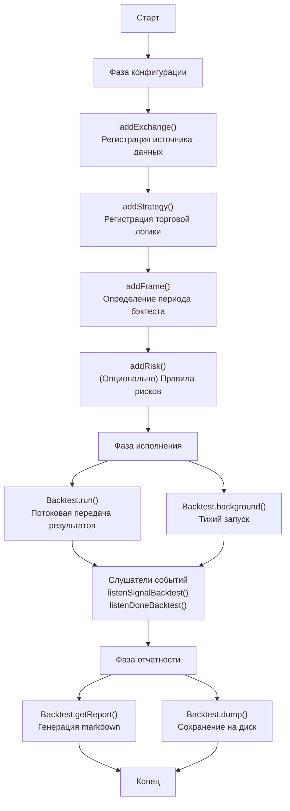
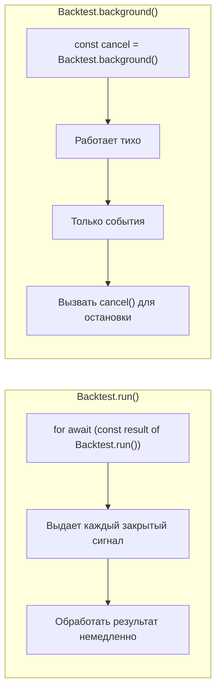
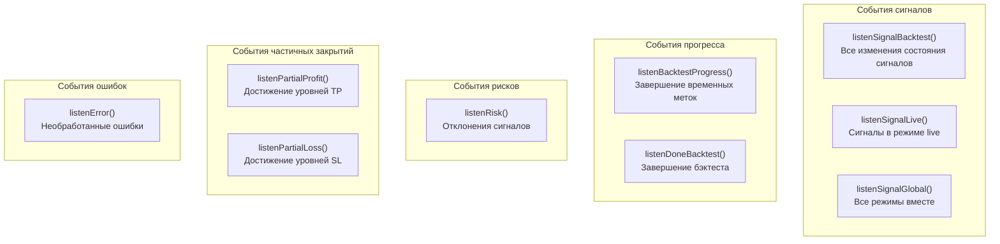
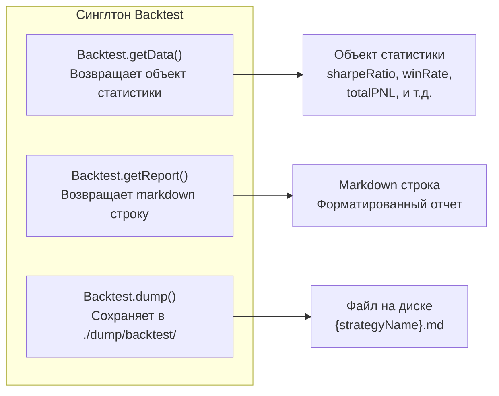
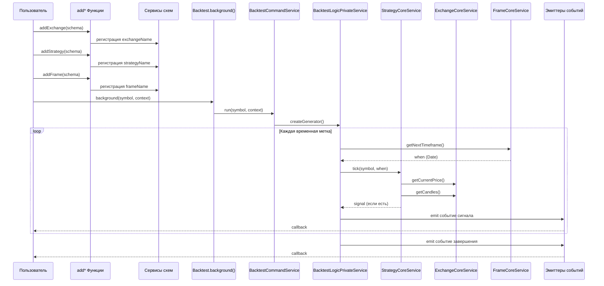

# Запуск первого бэктеста

Это руководство проведет вас через процесс создания и запуска вашего первого бэктеста с использованием backtest-kit. Вы узнаете, как настроить все необходимые компоненты и получить результаты тестирования стратегии.

## Обзор процесса

Фреймворк backtest-kit следует двухфазному жизненному циклу: **конфигурация** и **исполнение**. Во время конфигурации вы регистрируете компоненты с помощью функций `add*`. Во время исполнения вы запускаете бэктесты и получаете результаты.



---

## Шаг 1: Регистрация биржи

Функция `addExchange` регистрирует источник данных, который предоставляет исторические данные свечей и функции форматирования цен.

### Структура схемы биржи

| Поле | Тип | Описание |
|------|-----|----------|
| `exchangeName` | `string` | Уникальный идентификатор биржи |
| `getCandles` | `async function` | Получает OHLCV данные свечей |
| `formatPrice` | `async function` | Форматирует цены для отображения |
| `formatQuantity` | `async function` | Форматирует количество для отображения |
| `callbacks` | `object` (опционально) | Коллбэки жизненного цикла |

### Минимальный пример биржи

```typescript
import ccxt from "ccxt";
import { addExchange } from "backtest-kit";

addExchange({
  exchangeName: "binance-historical",
  getCandles: async (symbol, interval, since, limit) => {
    const exchange = new ccxt.binance();
    const ohlcv = await exchange.fetchOHLCV(
      symbol,
      interval,
      since.getTime(),
      limit
    );
    return ohlcv.map(([timestamp, open, high, low, close, volume]) => ({
      timestamp, open, high, low, close, volume
    }));
  },
  formatPrice: async (symbol, price) => price.toFixed(2),
  formatQuantity: async (symbol, quantity) => quantity.toFixed(8),
});
```

### Что происходит

Функция `getCandles` вызывается фреймворком во время выполнения бэктеста. Она получает:

- **symbol**: Торговая пара (например, "BTCUSDT")
- **interval**: Интервал свечей, соответствующий интервалу фрейма
- **since**: Временная метка начала (объект Date)
- **limit**: Максимальное количество свечей для возврата

---

## Шаг 2: Регистрация стратегии

Функция `addStrategy` регистрирует торговую логику, которая генерирует сигналы. Стратегия определяет, когда входить и выходить из позиций на основе рыночных данных.

### Структура схемы стратегии

| Поле | Тип | Описание |
|------|-----|----------|
| `strategyName` | `string` | Уникальный идентификатор стратегии |
| `interval` | `string` | Частота генерации сигналов (например, "5m", "1h") |
| `getSignal` | `async function` | Генерирует торговые сигналы |
| `riskName` | `string` (опционально) | Связанный профиль рисков |
| `sizingName` | `string` (опционально) | Конфигурация размера позиции |
| `callbacks` | `object` (опционально) | Коллбэки жизненного цикла (onOpen, onClose) |

### Структура возвращаемого сигнала

Функция `getSignal` должна возвращать объект со следующими полями:

| Поле | Тип | Обязательно | Описание |
|------|-----|-------------|----------|
| `position` | `"long" \| "short"` | Да | Направление сделки |
| `priceOpen` | `number` | Условно | Цена входа (требуется если не отложенный) |
| `priceTakeProfit` | `number` | Да | Цель тейк-профита |
| `priceStopLoss` | `number` | Да | Уровень стоп-лосса |
| `minuteEstimatedTime` | `number` | Да | Ожидаемая длительность сделки в минутах |
| `timestamp` | `number` | Да | Временная метка генерации сигнала |
| `priceActivate` | `number` | Нет | Триггерная цена условного входа |

### Минимальный пример стратегии

```typescript
import { addStrategy } from "backtest-kit";

addStrategy({
  strategyName: "simple-breakout",
  interval: "5m",
  getSignal: async (symbol) => {
    // Логика стратегии здесь
    // Вернуть null для отсутствия сигнала
    return {
      position: "long",
      priceOpen: 50000,
      priceTakeProfit: 51000,
      priceStopLoss: 49000,
      minuteEstimatedTime: 60,
      timestamp: Date.now(),
    };
  },
});
```

### Пример реальной стратегии с MACD

```typescript
import { addStrategy } from "backtest-kit";
import { MACD } from "technicalindicators";

addStrategy({
  strategyName: "macd-crossover",
  interval: "15m",
  getSignal: async (symbol) => {
    // Получить исторические данные для расчета индикаторов
    // (в реальной стратегии используйте методы фреймворка)
    const prices = await getHistoricalPrices(symbol);

    // Рассчитать MACD
    const macdResult = MACD.calculate({
      values: prices,
      fastPeriod: 12,
      slowPeriod: 26,
      signalPeriod: 9,
      SimpleMAOscillator: false,
      SimpleMASignal: false
    });

    const current = macdResult[macdResult.length - 1];
    const previous = macdResult[macdResult.length - 2];

    // Бычье пересечение
    if (previous.MACD < previous.signal && current.MACD > current.signal) {
      const currentPrice = prices[prices.length - 1];

      return {
        position: "long",
        priceOpen: currentPrice,
        priceTakeProfit: currentPrice * 1.02,  // +2%
        priceStopLoss: currentPrice * 0.99,    // -1%
        minuteEstimatedTime: 120,
        timestamp: Date.now(),
      };
    }

    // Медвежье пересечение
    if (previous.MACD > previous.signal && current.MACD < current.signal) {
      const currentPrice = prices[prices.length - 1];

      return {
        position: "short",
        priceOpen: currentPrice,
        priceTakeProfit: currentPrice * 0.98,  // -2%
        priceStopLoss: currentPrice * 1.01,    // +1%
        minuteEstimatedTime: 120,
        timestamp: Date.now(),
      };
    }

    // Нет сигнала
    return null;
  },
});
```

**Важно**: Возврат `null` или `undefined` означает отсутствие сигнала на текущем временном интервале.

---

## Шаг 3: Регистрация фрейма

Функция `addFrame` определяет исторический период для бэктестинга. Фрейм генерирует временные метки с указанным интервалом между начальной и конечной датами.

### Структура схемы фрейма

| Поле | Тип | Описание |
|------|-----|----------|
| `frameName` | `string` | Уникальный идентификатор фрейма |
| `interval` | `string` | Интервал временных меток (например, "1m", "1h", "1d") |
| `startDate` | `Date` | Дата начала бэктеста |
| `endDate` | `Date` | Дата окончания бэктеста |
| `callbacks` | `object` (опционально) | Коллбэк генерации временных меток |

### Поддерживаемые интервалы

- **Минуты**: `"1m"`, `"3m"`, `"5m"`, `"15m"`, `"30m"`
- **Часы**: `"1h"`, `"2h"`, `"4h"`, `"6h"`, `"8h"`, `"12h"`
- **Дни**: `"1d"`, `"3d"`

### Минимальный пример фрейма

```typescript
import { addFrame } from "backtest-kit";

addFrame({
  frameName: "december-2025",
  interval: "1m",
  startDate: new Date("2025-12-01T00:00:00.000Z"),
  endDate: new Date("2025-12-31T23:59:59.999Z"),
});
```

### Примеры различных периодов

```typescript
// Краткосрочный бэктест (1 неделя)
addFrame({
  frameName: "week-test",
  interval: "5m",
  startDate: new Date("2025-12-01"),
  endDate: new Date("2025-12-08"),
});

// Среднесрочный бэктест (1 месяц)
addFrame({
  frameName: "month-test",
  interval: "15m",
  startDate: new Date("2025-11-01"),
  endDate: new Date("2025-12-01"),
});

// Долгосрочный бэктест (1 год)
addFrame({
  frameName: "year-test",
  interval: "1h",
  startDate: new Date("2024-01-01"),
  endDate: new Date("2025-01-01"),
});
```

---

## Шаг 4: Регистрация правил рисков (опционально)

Функция `addRisk` определяет правила валидации, которые отклоняют сигналы на основе ограничений уровня портфеля.

### Минимальный пример рисков

```typescript
import { addRisk } from "backtest-kit";

addRisk({
  riskName: "conservative",
  maxConcurrentPositions: 3,
  validations: [
    {
      validate: ({ pendingSignal, currentPrice }) => {
        const { priceOpen = currentPrice, priceTakeProfit, position } = pendingSignal;
        const tpDistance = position === "long"
          ? ((priceTakeProfit - priceOpen) / priceOpen) * 100
          : ((priceOpen - priceTakeProfit) / priceOpen) * 100;

        if (tpDistance < 1) {
          throw new Error(`TP расстояние ${tpDistance.toFixed(2)}% < 1%`);
        }
      },
      note: "Расстояние TP должно быть минимум 1%",
    },
  ],
});
```

Чтобы связать профиль рисков со стратегией, установите `riskName` в схеме стратегии:

```typescript
addStrategy({
  strategyName: "macd-crossover",
  interval: "15m",
  riskName: "conservative",  // Связь с профилем рисков
  getSignal: async (symbol) => {
    // ...
  },
});
```

---

## Шаг 5: Запуск бэктеста

Синглтон `Backtest` предоставляет методы для запуска бэктестов. Фреймворк предлагает два паттерна выполнения: **потоковый** и **фоновый**.

### Сравнение методов выполнения



### Потоковый паттерн: `Backtest.run()`

Метод `run` возвращает асинхронный генератор, который выдает каждый закрытый сигнал с расчетами PNL:

```typescript
import { Backtest } from "backtest-kit";

for await (const result of Backtest.run("BTCUSDT", {
  strategyName: "macd-crossover",
  exchangeName: "binance-historical",
  frameName: "december-2025",
})) {
  console.log("Сигнал закрыт:");
  console.log("  PNL:", result.pnl.pnlPercentage.toFixed(2) + "%");
  console.log("  Длительность:", result.duration, "минут");
  console.log("  Причина выхода:", result.reason);
}

console.log("Бэктест завершен");
```

### Фоновый паттерн: `Backtest.background()`

Метод `background` запускает бэктест тихо и возвращает функцию отмены:

```typescript
import { Backtest } from "backtest-kit";

const cancel = Backtest.background("BTCUSDT", {
  strategyName: "macd-crossover",
  exchangeName: "binance-historical",
  frameName: "december-2025",
});

// Бэктест работает асинхронно
// Используйте слушателей событий для мониторинга прогресса

// Остановить досрочно при необходимости
// cancel();
```

---

## Шаг 6: Мониторинг с помощью слушателей событий

Слушатели событий позволяют реагировать на события бэктеста асинхронно.

### Функции слушателей событий



### Слушатель событий сигналов

```typescript
import { listenSignalBacktest } from "backtest-kit";

listenSignalBacktest((event) => {
  console.log(`[${event.action}] ${event.symbol} @ ${event.strategyName}`);

  if (event.action === "opened") {
    console.log(`  Вход: ${event.signal.priceOpen}`);
  }

  if (event.action === "closed") {
    console.log(`  PNL: ${event.pnl.pnlPercentage.toFixed(2)}%`);
    console.log(`  Причина: ${event.reason}`);
  }
});
```

События сигналов включают следующие действия:
- `"idle"`: Стратегия ожидает следующего сигнала
- `"scheduled"`: Запланирован условный вход
- `"opened"`: Позиция открыта
- `"closed"`: Позиция закрыта
- `"cancelled"`: Отложенный сигнал истек

### Слушатель прогресса

```typescript
import { listenBacktestProgress } from "backtest-kit";

listenBacktestProgress((event) => {
  const percent = (event.progress * 100).toFixed(2);
  console.log(`Прогресс: ${percent}%`);
  console.log(`Обработано: ${event.processedFrames} / ${event.totalFrames}`);
});
```

### Слушатель завершения

```typescript
import { listenDoneBacktest, Backtest } from "backtest-kit";

listenDoneBacktest(async (event) => {
  console.log(`Бэктест завершен: ${event.symbol}`);

  // Генерация отчета после завершения
  await Backtest.dump(event.symbol, event.strategyName);
});
```

---

## Шаг 7: Генерация отчетов о производительности

После завершения бэктеста используйте методы отчетности для анализа результатов.

### Методы отчетности



### Структура объекта статистики

```typescript
import { Backtest } from "backtest-kit";

const stats = await Backtest.getData("BTCUSDT", "macd-crossover");

console.log("Метрики производительности:");
console.log("  Коэффициент Шарпа:", stats.sharpeRatio);
console.log("  Процент выигрышей:", stats.winRate);
console.log("  Общий PNL:", stats.totalPNL);
console.log("  Максимальная просадка:", stats.maxDrawdown);
console.log("  Всего сделок:", stats.totalTrades);
```

### Генерация Markdown отчета

```typescript
import { Backtest } from "backtest-kit";

const markdown = await Backtest.getReport("BTCUSDT", "macd-crossover");
console.log(markdown);
```

### Сохранение отчета на диск

```typescript
import { Backtest } from "backtest-kit";

// Сохранить по пути по умолчанию: ./dump/backtest/macd-crossover.md
await Backtest.dump("BTCUSDT", "macd-crossover");

// Сохранить по пользовательскому пути: ./custom/reports/macd-crossover.md
await Backtest.dump("BTCUSDT", "macd-crossover", "./custom/reports");
```

---

## Полный рабочий пример

Вот полный пример с минимальной конфигурацией бэктеста:

```typescript
import ccxt from "ccxt";
import {
  addExchange,
  addStrategy,
  addFrame,
  Backtest,
  listenDoneBacktest,
  listenSignalBacktest,
} from "backtest-kit";

// Шаг 1: Регистрация биржи
addExchange({
  exchangeName: "binance-historical",
  getCandles: async (symbol, interval, since, limit) => {
    const exchange = new ccxt.binance();
    const ohlcv = await exchange.fetchOHLCV(
      symbol,
      interval,
      since.getTime(),
      limit
    );
    return ohlcv.map(([timestamp, open, high, low, close, volume]) => ({
      timestamp, open, high, low, close, volume
    }));
  },
  formatPrice: async (symbol, price) => price.toFixed(2),
  formatQuantity: async (symbol, quantity) => quantity.toFixed(8),
});

// Шаг 2: Регистрация стратегии
addStrategy({
  strategyName: "simple-breakout",
  interval: "5m",
  getSignal: async (symbol) => {
    // Упрощенная стратегия: всегда возвращает длинный сигнал
    return {
      position: "long",
      priceOpen: 50000,
      priceTakeProfit: 51000,
      priceStopLoss: 49000,
      minuteEstimatedTime: 60,
      timestamp: Date.now(),
    };
  },
});

// Шаг 3: Регистрация фрейма
addFrame({
  frameName: "december-2025",
  interval: "1m",
  startDate: new Date("2025-12-01T00:00:00.000Z"),
  endDate: new Date("2025-12-02T00:00:00.000Z"),
});

// Шаг 4: Слушатели событий
listenSignalBacktest((event) => {
  if (event.action === "closed") {
    console.log(`Сигнал закрыт: PNL ${event.pnl.pnlPercentage.toFixed(2)}%`);
  }
});

listenDoneBacktest(async (event) => {
  console.log("Бэктест завершен");
  await Backtest.dump(event.symbol, event.strategyName);
  console.log("Отчет сохранен в ./dump/backtest/simple-breakout.md");
});

// Шаг 5: Запуск бэктеста в фоновом режиме
Backtest.background("BTCUSDT", {
  strategyName: "simple-breakout",
  exchangeName: "binance-historical",
  frameName: "december-2025",
});
```

---

## Диаграмма потока выполнения

Эта диаграмма показывает, как компоненты конфигурации переходят в исполнение:



---

## Следующие шаги

После запуска вашего первого бэктеста:

1. **[Понимание сигналов](03-understanding-signals.md)** - узнайте о жизненном цикле торговых сигналов и машине состояний
2. **[Настройка живой торговли](04-live-trading.md)** - переход к реальному исполнению с защитой от сбоев
3. **[Управление рисками](05-risk-management.md)** - реализация продвинутых правил валидации портфеля
4. **[AI оптимизация](06-ai-optimization.md)** - генерация стратегий с помощью больших языковых моделей

