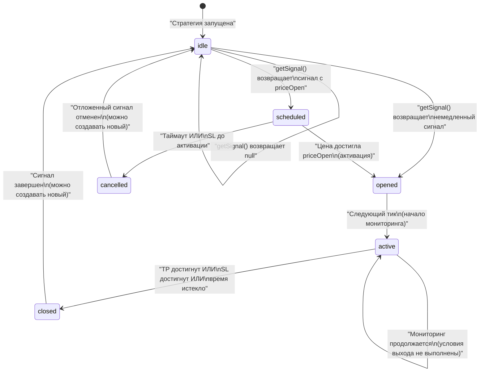
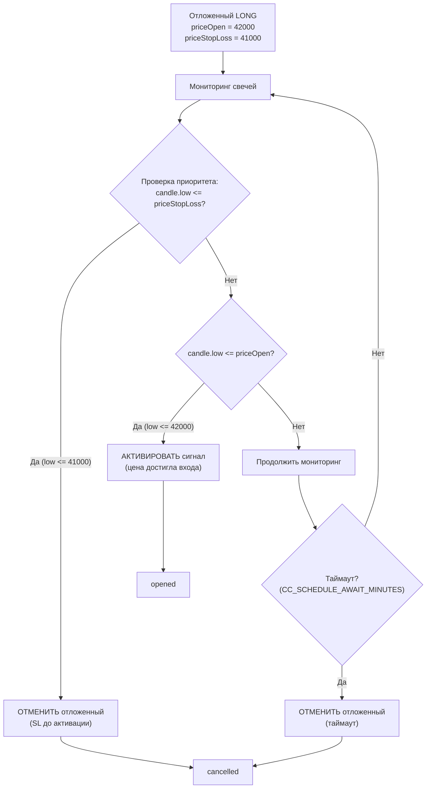
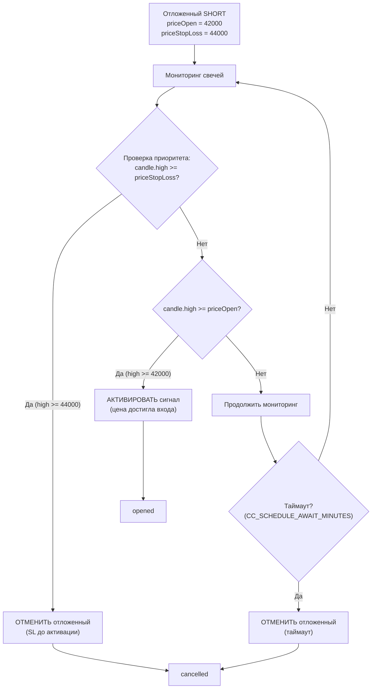
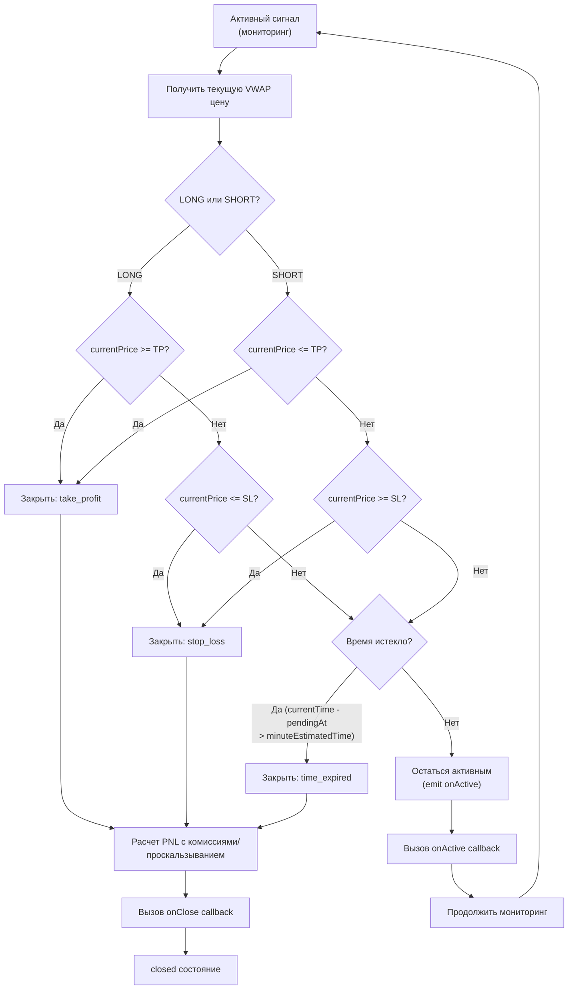

# Понимание торговых сигналов

Это руководство объясняет полный жизненный цикл торговых сигналов в backtest-kit - от генерации до закрытия. Понимание машины состояний сигналов критически важно для создания надежных торговых стратегий.

## Что такое торговый сигнал?

Торговый сигнал - это структурированная инструкция для открытия позиции на рынке. Каждый сигнал содержит:

- **Направление**: LONG (покупка) или SHORT (продажа)
- **Цена входа**: Когда открыть позицию
- **Тейк-профит**: Целевая цена для фиксации прибыли
- **Стоп-лосс**: Уровень защиты от больших убытков
- **Время жизни**: Максимальная длительность позиции

---

## Машина состояний сигналов

Каждый сигнал проходит через одно из шести возможных состояний. Фреймворк строго контролирует переходы между состояниями.



**Критически важное ограничение**: Только **один** сигнал может быть активен для пары символ-стратегия в любой момент времени. Новые сигналы ожидают, пока предыдущий сигнал не достигнет состояния `closed` или `cancelled`.

---

## Описание состояний

### 1. Idle (Ожидание)

Нет активного сигнала. Стратегия ожидает генерации нового сигнала.

**Когда**:
- Стратегия только запустилась
- Предыдущий сигнал закрыт или отменен
- Функция `getSignal()` вернула `null`

**Данные события**:
```typescript
{
  action: "idle",
  signal: null,
  currentPrice: 50000,
  strategyName: "macd-crossover",
  exchangeName: "binance",
  symbol: "BTCUSDT"
}
```

---

### 2. Scheduled (Отложенный)

Сигнал ожидает, когда цена достигнет `priceOpen` (поведение лимитного ордера).

**Когда**: Функция `getSignal()` возвращает сигнал с указанным `priceOpen`, который еще не достигнут.

**Пример LONG сигнала**:
```typescript
{
  position: "long",
  priceOpen: 42000,      // Вход когда цена упадет до 42000
  priceTakeProfit: 45000,
  priceStopLoss: 40000,
  minuteEstimatedTime: 120,
  timestamp: Date.now()
}
```

**Что происходит**:
1. Сигнал сохраняется как "отложенный"
2. Каждый тик проверяет, достигла ли цена `priceOpen`
3. Если цена достигает `priceOpen` → переход в состояние `opened`
4. Если таймаут или SL до активации → переход в состояние `cancelled`

**Важные особенности**:
- **LONG**: активируется когда `currentPrice <= priceOpen` (цена падает до входа)
- **SHORT**: активируется когда `currentPrice >= priceOpen` (цена растет до входа)

---

### 3. Opened (Открыт)

Позиция только что открыта. Это промежуточное состояние, которое переходит в `active` на следующем тике.

**Когда**:
- Немедленный сигнал: `idle` → `opened` (когда `priceOpen` не указан)
- Отложенный сигнал: `scheduled` → `opened` (когда цена активации достигнута)

**Данные события**:
```typescript
{
  action: "opened",
  signal: {
    id: "sig_123",
    position: "long",
    priceOpen: 42000,
    priceTakeProfit: 45000,
    priceStopLoss: 40000,
    pendingAt: 1702800000000,
    minuteEstimatedTime: 120
  },
  currentPrice: 42000,
  strategyName: "macd-crossover",
  exchangeName: "binance",
  symbol: "BTCUSDT"
}
```

**Использование**: Этот момент идеален для отправки уведомлений о входе в позицию или логирования начала сделки.

---

### 4. Active (Активный)

Сигнал отслеживается на предмет условий выхода (TP, SL или истечение времени).

**Проверяемые условия выхода**:

#### Для LONG позиций:
1. **Тейк-профит**: `currentPrice >= signal.priceTakeProfit`
2. **Стоп-лосс**: `currentPrice <= signal.priceStopLoss`
3. **Истечение времени**: `currentTime - signal.pendingAt > signal.minuteEstimatedTime * 60 * 1000`

#### Для SHORT позиций:
1. **Тейк-профит**: `currentPrice <= signal.priceTakeProfit`
2. **Стоп-лосс**: `currentPrice >= signal.priceStopLoss`
3. **Истечение времени**: (аналогично LONG)

**Данные события**:
```typescript
{
  action: "active",
  signal: { /* данные сигнала */ },
  currentPrice: 43500,
  percentTp: 50,   // Прогресс к TP: 50%
  percentSl: 75,   // Удаленность от SL: 75%
  strategyName: "macd-crossover",
  exchangeName: "binance",
  symbol: "BTCUSDT"
}
```

**Использование**: Мониторинг `percentTp` и `percentSl` позволяет отслеживать прогресс позиции в реальном времени.

---

### 5. Closed (Закрыт)

Сигнал завершен с расчетом финального PNL. Это терминальное состояние.

**Причины закрытия**:
- `"take_profit"` - Цена достигла целевого уровня прибыли
- `"stop_loss"` - Сработал защитный уровень
- `"time_expired"` - Истекло максимальное время жизни позиции

**Данные события**:
```typescript
{
  action: "closed",
  signal: { /* данные сигнала */ },
  currentPrice: 45000,
  closeReason: "take_profit",
  closeTimestamp: 1702807200000,
  pnl: {
    pnlPercentage: 6.7,      // +6.7% после всех издержек
    priceOpen: 42000,
    priceClose: 45000,
    priceOpenAdjusted: 42168,  // С учетом проскальзывания и комиссий
    priceCloseAdjusted: 44910
  },
  strategyName: "macd-crossover",
  exchangeName: "binance",
  symbol: "BTCUSDT"
}
```

#### Расчет PNL

**Для LONG позиций**:
```
Скорректированная цена входа:
  priceOpenAdjusted = priceOpen × (1 + slippage) × (1 + fee)

Скорректированная цена выхода:
  priceCloseAdjusted = priceClose × (1 - slippage) × (1 - fee)

PNL в процентах:
  pnlPercentage = ((priceCloseAdjusted - priceOpenAdjusted) / priceOpenAdjusted) × 100
```

**Для SHORT позиций**:
```
Скорректированная цена входа:
  priceOpenAdjusted = priceOpen × (1 - slippage) × (1 - fee)

Скорректированная цена выхода:
  priceCloseAdjusted = priceClose × (1 + slippage) × (1 + fee)

PNL в процентах:
  pnlPercentage = ((priceOpenAdjusted - priceCloseAdjusted) / priceOpenAdjusted) × 100
```

**Торговые издержки по умолчанию**:
- `CC_PERCENT_SLIPPAGE = 0.1%` (воздействие на рынок)
- `CC_PERCENT_FEE = 0.1%` (комиссия биржи)
- **Общие издержки: ~0.4%** (2× проскальзывание + 2× комиссия)

**Важно**: Для безубыточности сигнал должен достичь минимум 0.4% валовой прибыли.

---

### 6. Cancelled (Отменен)

Отложенный сигнал был отменен без открытия позиции. Это терминальное состояние.

**Причины отмены**:

1. **Таймаут**: Отложенный сигнал не активировался в течение `CC_SCHEDULE_AWAIT_MINUTES` (по умолчанию 60 минут)
2. **Стоп-лосс до активации**: Цена достигла SL до того, как достигла `priceOpen`

**Данные события**:
```typescript
{
  action: "cancelled",
  signal: {
    id: "sig_124",
    position: "long",
    priceOpen: 42000,
    scheduledAt: 1702800000000,
    _isScheduled: true
  },
  currentPrice: 39000,
  closeTimestamp: 1702803600000,
  strategyName: "macd-crossover",
  exchangeName: "binance",
  symbol: "BTCUSDT"
}
```

---

## Отложенные сигналы: LONG vs SHORT

Логика активации и отмены отложенных сигналов отличается для LONG и SHORT позиций из-за противоположных направлений движения цены.

### Активация LONG позиции



**Ключевое правило**: Для LONG позиций проверка стоп-лосса имеет **приоритет** над проверкой активации.

**Обоснование**: Если цена падает до обоих уровней (SL и priceOpen) на одной свече, позиция должна быть отменена (а не открыта и немедленно закрыта), предотвращая ненужные комиссии.

---

### Активация SHORT позиции



**Ключевое правило**: Для SHORT позиций проверка стоп-лосса имеет **приоритет** над проверкой активации.

---

## Примеры сценариев отмены

### Пример 1: LONG сигнал - таймаут

```typescript
// Отложенный LONG сигнал создан
{
  position: "long",
  priceOpen: 42000,
  priceTakeProfit: 45000,
  priceStopLoss: 40000,
  scheduledAt: 10:00
}

// Цена не достигает 42000 в течение 60 минут
// Время: 11:00 - Таймаут!
// Результат: CANCELLED (причина: timeout)
```

### Пример 2: LONG сигнал - SL до активации

```typescript
// Отложенный LONG сигнал создан
{
  position: "long",
  priceOpen: 42000,
  priceStopLoss: 41000
}

// Путь цены: 43000 → 40500 (пропускает priceOpen, достигает SL)
// Результат: CANCELLED (причина: SL до активации)
// Обоснование: Открытие по 42000 с немедленным SL по 41000 тратит комиссии впустую
```

### Пример 3: SHORT сигнал - SL до активации

```typescript
// Отложенный SHORT сигнал создан
{
  position: "short",
  priceOpen: 42000,
  priceStopLoss: 44000
}

// Путь цены: 41000 → 45000 (пропускает priceOpen, достигает SL)
// Результат: CANCELLED (причина: SL до активации)
```

---

## Правила валидации сигналов

Фреймворк применяет строгие правила валидации для предотвращения невалидных сделок.

### Общие правила валидации

| Проверка | LONG | SHORT | Ошибка при несоблюдении |
|----------|------|-------|-------------------------|
| Позиция TP/SL | `TP > priceOpen > SL` | `SL > priceOpen > TP` | Нарушена логика цен |
| Расстояние TP | `((TP - priceOpen) / priceOpen) × 100 ≥ 0.5%` | `((priceOpen - TP) / priceOpen) × 100 ≥ 0.5%` | TP слишком близко для покрытия комиссий |
| Мин. расстояние SL | `((priceOpen - SL) / priceOpen) × 100 ≥ 0.5%` | `((SL - priceOpen) / priceOpen) × 100 ≥ 0.5%` | SL слишком близко (мгновенная остановка) |
| Макс. расстояние SL | `((priceOpen - SL) / priceOpen) × 100 ≤ 20%` | `((SL - priceOpen) / priceOpen) × 100 ≤ 20%` | SL слишком далеко (катастрофический убыток) |
| Время жизни | `minuteEstimatedTime ≤ 1440 минут` | То же | Время жизни сигнала слишком длинное |

### Валидация немедленных сигналов

Для сигналов, которые открываются немедленно, дополнительные проверки предотвращают мгновенное закрытие:

**LONG немедленный**:
```
currentPrice ДОЛЖНА быть между SL и TP:
  priceStopLoss < currentPrice < priceTakeProfit
```

**Случаи ошибок**:
- `currentPrice <= priceStopLoss` → "Сигнал будет немедленно закрыт стоп-лоссом"
- `currentPrice >= priceTakeProfit` → "Возможность прибыли уже упущена"

**SHORT немедленный**:
```
currentPrice ДОЛЖНА быть между TP и SL:
  priceTakeProfit < currentPrice < priceStopLoss
```

---

## Мониторинг сигналов с помощью событий

### Слушатели событий

```typescript
import { listenSignalBacktest } from "backtest-kit";

listenSignalBacktest((event) => {
  console.log(`[${event.action}] ${event.symbol}`);

  switch (event.action) {
    case "idle":
      console.log("  Ожидание нового сигнала");
      break;

    case "scheduled":
      console.log(`  Отложен: вход по ${event.signal.priceOpen}`);
      break;

    case "opened":
      console.log(`  Позиция открыта: ${event.signal.position} @ ${event.currentPrice}`);
      break;

    case "active":
      console.log(`  Мониторинг: TP ${event.percentTp}%, SL ${event.percentSl}%`);
      break;

    case "closed":
      console.log(`  Закрыто: ${event.closeReason}`);
      console.log(`  PNL: ${event.pnl.pnlPercentage.toFixed(2)}%`);
      break;

    case "cancelled":
      console.log(`  Отложенный сигнал отменен`);
      break;
  }
});
```

### Коллбэки стратегии

Альтернативно, используйте коллбэки в схеме стратегии:

```typescript
addStrategy({
  strategyName: "macd-crossover",
  interval: "15m",
  getSignal: async (symbol) => {
    // Логика генерации сигнала
  },
  callbacks: {
    onSchedule: (symbol, signal, currentPrice, backtest) => {
      console.log(`Отложенный сигнал создан для ${symbol}`);
    },
    onOpen: (symbol, signal, currentPrice, backtest) => {
      console.log(`Позиция открыта: ${signal.position} @ ${currentPrice}`);
      // Отправить уведомление, обновить UI, и т.д.
    },
    onActive: (symbol, signal, currentPrice, backtest) => {
      // Вызывается каждый тик во время мониторинга
      // Используйте для отслеживания прогресса
    },
    onClose: (symbol, signal, priceClose, backtest) => {
      console.log(`Позиция закрыта @ ${priceClose}`);
      // Логировать результаты сделки
    },
    onCancel: (symbol, signal, currentPrice, backtest) => {
      console.log(`Отложенный сигнал отменен @ ${currentPrice}`);
    },
  },
});
```

---

## Постоянство сигналов (Live Trading)

В режиме live trading активные сигналы сохраняются на диск для защиты от сбоев.

### Что сохраняется

| Состояние | Сохраняется? | Причина |
|-----------|--------------|---------|
| `idle` | ❌ Нет | Нет данных для сохранения |
| `scheduled` | ✅ Да | В PersistScheduleAdapter |
| `opened` | ✅ Да | В PersistSignalAdapter |
| `active` | ✅ Да | В PersistSignalAdapter |
| `closed` | ❌ Нет | Позиция завершена, очищена с диска |
| `cancelled` | ❌ Нет | Отложенный сигнал отменен, очищен с диска |

### Восстановление после сбоя

При перезапуске процесса live trading сигналы восстанавливаются с диска:

```typescript
// При запуске Live.background()
1. Чтение PersistSignalAdapter → восстановление активной позиции
2. Чтение PersistScheduleAdapter → восстановление отложенного сигнала
3. Вызов соответствующих коллбэков (onActive / onSchedule)
4. Продолжение мониторинга с восстановленного состояния
```

**Ключевые гарантии**:
- Нет дублирующих сигналов (единый источник истины)
- Нет потерянных позиций (атомарная запись предотвращает повреждение)
- Бесшовное восстановление (коллбэки уведомляют о восстановленном состоянии)

---

## Диаграмма проверки условий выхода



---

## Практический пример: Полный жизненный цикл

```typescript
import {
  addStrategy,
  listenSignalBacktest,
  Backtest
} from "backtest-kit";

// Стратегия с отложенным входом
addStrategy({
  strategyName: "breakout-strategy",
  interval: "15m",
  getSignal: async (symbol) => {
    const currentPrice = 50000;

    // Отложенный LONG: ждем пробития вниз к 48000
    return {
      position: "long",
      priceOpen: 48000,        // Активация при падении
      priceTakeProfit: 50000,  // +4.17% целевая прибыль
      priceStopLoss: 46500,    // -3.13% максимальный убыток
      minuteEstimatedTime: 240,  // 4 часа
      timestamp: Date.now(),
    };
  },
  callbacks: {
    onSchedule: (symbol, signal) => {
      console.log(`✓ Отложенный сигнал: вход по ${signal.priceOpen}`);
    },
    onOpen: (symbol, signal, price) => {
      console.log(`✓ Позиция открыта по ${price}`);
    },
    onActive: (symbol, signal, price) => {
      console.log(`→ Мониторинг: текущая цена ${price}`);
    },
    onClose: (symbol, signal, price) => {
      console.log(`✓ Позиция закрыта по ${price}`);
    },
    onCancel: (symbol, signal) => {
      console.log(`✗ Отложенный сигнал отменен`);
    },
  },
});

// Мониторинг всех событий
listenSignalBacktest((event) => {
  console.log(`[${event.action}] ${event.symbol} @ ${event.currentPrice}`);

  if (event.action === "closed") {
    console.log(`  Причина: ${event.closeReason}`);
    console.log(`  PNL: ${event.pnl.pnlPercentage.toFixed(2)}%`);
  }
});

// Запуск бэктеста
Backtest.background("BTCUSDT", {
  strategyName: "breakout-strategy",
  exchangeName: "binance",
  frameName: "december-2025",
});
```

**Возможный вывод**:
```
✓ Отложенный сигнал: вход по 48000
[scheduled] BTCUSDT @ 50000
[opened] BTCUSDT @ 48000
✓ Позиция открыта по 48000
[active] BTCUSDT @ 48500
→ Мониторинг: текущая цена 48500
[active] BTCUSDT @ 49200
→ Мониторинг: текущая цена 49200
[closed] BTCUSDT @ 50000
✓ Позиция закрыта по 50000
  Причина: take_profit
  PNL: 3.76%
```

---

## Следующие шаги

После понимания жизненного цикла сигналов:

1. **[Настройка живой торговли](04-live-trading.md)** - переход к реальному исполнению с автоматическим восстановлением после сбоев
2. **[Управление рисками](05-risk-management.md)** - реализация правил валидации портфеля и ограничений позиций
3. **[AI оптимизация](06-ai-optimization.md)** - генерация стратегий с использованием больших языковых моделей
