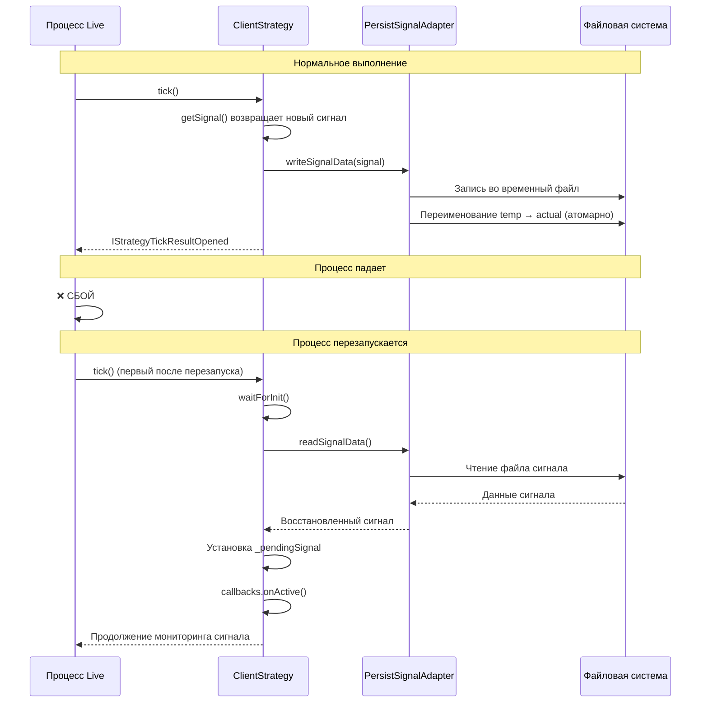

# Настройка живой торговли

Это руководство объясняет, как перейти от бэктестинга к реальной торговле с использованием режима Live Trading в backtest-kit. Вы узнаете о непрерывном выполнении, восстановлении после сбоев и безопасном управлении состоянием.

## Обзор режима Live Trading

Режим Live Trading выполняет стратегии в бесконечном цикле, обрабатывая данные реального времени и управляя открытыми позициями с защитой состояния от сбоев.

### Сравнение: Live vs Backtest

| Характеристика | Live режим | Backtest режим |
|----------------|-----------|----------------|
| **Паттерн выполнения** | Бесконечный цикл `while(true)` | Конечная итерация через временные метки |
| **Прогрессия времени** | `new Date()` на каждом тике | Исторические `Date` из сервиса фреймов |
| **Обработка сигналов** | Только `tick()` | `tick()` + `backtest()` быстрое пролистывание |
| **Постоянство** | Включено (восстановление после сбоя) | Отключено |
| **Очередь событий** | Ограниченная (MAX_EVENTS=25) | Неограниченная |
| **Пауза между тиками** | TICK_TTL (1 мин + 1 мс) | Нет (немедленно) |
| **Завершение** | Никогда (требуется ручная остановка) | Когда временные метки исчерпаны |

---

## Настройка для живой торговли

### Шаг 1: Подготовка API ключей биржи

Для живой торговли вам нужны действующие API ключи от криптовалютной биржи.

**Создайте файл `.env`**:
```bash
# API учетные данные
BINANCE_API_KEY=your_api_key_here
BINANCE_API_SECRET=your_api_secret_here

# Конфигурация режима
ENVIRONMENT=production
LOG_LEVEL=info
```

**Важно**:
- Никогда не коммитьте `.env` в систему контроля версий
- Используйте API ключи только для чтения для тестирования
- Для реальной торговли включите торговые права осторожно

### Шаг 2: Настройка биржи для живой торговли

```typescript
import ccxt from "ccxt";
import { addExchange } from "backtest-kit";

addExchange({
  exchangeName: "binance-live",
  getCandles: async (symbol, interval, since, limit) => {
    const exchange = new ccxt.binance({
      apiKey: process.env.BINANCE_API_KEY,
      secret: process.env.BINANCE_API_SECRET,
      enableRateLimit: true,  // Важно для живой торговли!
    });

    const ohlcv = await exchange.fetchOHLCV(
      symbol,
      interval,
      since.getTime(),
      limit
    );

    return ohlcv.map(([timestamp, open, high, low, close, volume]) => ({
      timestamp, open, high, low, close, volume
    }));
  },
  formatPrice: async (symbol, price) => {
    const exchange = new ccxt.binance();
    const market = await exchange.loadMarkets();
    return exchange.priceToPrecision(symbol, price);
  },
  formatQuantity: async (symbol, quantity) => {
    const exchange = new ccxt.binance();
    const market = await exchange.loadMarkets();
    return exchange.amountToPrecision(symbol, quantity);
  },
});
```

**Ключевые отличия от бэктеста**:
- `enableRateLimit: true` - предотвращает бан от биржи
- `priceToPrecision()` и `amountToPrecision()` - соответствие правилам биржи
- Реальные API ключи для доступа к аккаунту

---

## Запуск живой торговли

### Метод 1: Live.run() - Потоковое выполнение

Метод `run` возвращает асинхронный генератор, который выдает каждый открытый и закрытый сигнал:

```typescript
import { Live } from "backtest-kit";

console.log("Запуск живой торговли...");

for await (const result of Live.run("BTCUSDT", {
  strategyName: "macd-crossover",
  exchangeName: "binance-live",
})) {
  if (result.action === "opened") {
    console.log("✓ Новая позиция открыта:");
    console.log(`  Направление: ${result.signal.position}`);
    console.log(`  Вход: ${result.signal.priceOpen}`);
    console.log(`  Take Profit: ${result.signal.priceTakeProfit}`);
    console.log(`  Stop Loss: ${result.signal.priceStopLoss}`);

    // Отправить уведомление (email, Telegram, и т.д.)
    await sendNotification(`Открыта ${result.signal.position} позиция по ${result.signal.priceOpen}`);
  }

  if (result.action === "closed") {
    console.log("✓ Позиция закрыта:");
    console.log(`  Причина: ${result.closeReason}`);
    console.log(`  PNL: ${result.pnl.pnlPercentage.toFixed(2)}%`);
    console.log(`  Цена выхода: ${result.currentPrice}`);

    // Логировать результаты сделки
    await logTrade({
      symbol: result.symbol,
      pnl: result.pnl.pnlPercentage,
      reason: result.closeReason,
    });
  }
}
```

**Примечание**: Генератор никогда не завершается - работает до ручной остановки или завершения процесса.

### Метод 2: Live.background() - Фоновое выполнение

Метод `background` запускает живую торговлю в фоновом режиме, возвращая функцию отмены:

```typescript
import { Live, listenSignalLive } from "backtest-kit";

// Настройка слушателей событий
listenSignalLive((event) => {
  console.log(`[${event.action}] ${event.symbol} @ ${event.currentPrice}`);

  if (event.action === "opened") {
    console.log(`  Позиция открыта: ${event.signal.position}`);
  }

  if (event.action === "closed") {
    console.log(`  PNL: ${event.pnl.pnlPercentage.toFixed(2)}%`);
  }
});

// Запуск в фоновом режиме
const cancel = Live.background("BTCUSDT", {
  strategyName: "macd-crossover",
  exchangeName: "binance-live",
});

console.log("Живая торговля запущена в фоновом режиме");
console.log("Нажмите Ctrl+C для остановки");

// Обработка graceful shutdown
process.on("SIGINT", async () => {
  console.log("\nОстановка живой торговли...");
  cancel();

  // Ждем закрытия активных позиций
  await new Promise(resolve => setTimeout(resolve, 5000));

  console.log("Живая торговля остановлена");
  process.exit(0);
});
```

---

## Восстановление после сбоев

Одна из самых мощных функций режима Live - автоматическое восстановление состояния после сбоев процесса.

### Как работает восстановление



### Что сохраняется

| Состояние сигнала | Сохраняется? | Хранилище |
|-------------------|--------------|-----------|
| `idle` | ❌ Нет | Нет данных |
| `scheduled` | ✅ Да | PersistScheduleAdapter |
| `opened` | ✅ Да | PersistSignalAdapter |
| `active` | ✅ Да | PersistSignalAdapter |
| `closed` | ❌ Нет | Позиция завершена |
| `cancelled` | ❌ Нет | Сигнал отменен |

### Атомарная запись данных

Система постоянства использует атомарную запись файлов для предотвращения повреждения при сбоях:

```typescript
// Внутренняя реализация (упрощенно)
async function writeSignalData(signal) {
  // 1. Сериализовать в JSON
  const json = JSON.stringify(signal);

  // 2. Записать во временный файл
  const tempPath = `./data/signals/${symbol}-${strategy}.json.tmp`;
  await fs.writeFile(tempPath, json);

  // 3. Атомарное переименование
  const actualPath = `./data/signals/${symbol}-${strategy}.json`;
  await fs.rename(tempPath, actualPath);  // Атомарная операция!

  // Если сбой происходит во время записи,
  // временный файл остается сиротским,
  // но оригинальный файл остается неповрежденным
}
```

**Ключевые гарантии**:
- Нет дублирующих сигналов (единый источник истины)
- Нет потерянных позиций (атомарная запись)
- Бесшовное восстановление (коллбэки уведомляют о восстановленном состоянии)

---

## Управление жизненным циклом

### Остановка живой торговли

```typescript
import { Live } from "backtest-kit";

// Остановить стратегию от генерации новых сигналов
await Live.stop("BTCUSDT", "macd-crossover");

// Активные позиции завершаются нормально
// Новые сигналы больше не генерируются
```

**Поведение при остановке**:
1. Устанавливает внутренний флаг `_isStopped` в `ClientStrategy`
2. Предотвращает вызов `getSignal()` на последующих тиках
3. НЕ принудительно закрывает активные позиции
4. Позволяет текущим сигналам достичь TP/SL/timeout естественным образом

### Graceful Shutdown

```typescript
import { Live, listenDoneLive } from "backtest-kit";

// Запуск живой торговли
const cancel = Live.background("BTCUSDT", {
  strategyName: "macd-crossover",
  exchangeName: "binance-live",
});

// Слушатель события завершения
listenDoneLive((event) => {
  console.log(`Живая торговля завершена: ${event.symbol}`);
  console.log(`Стратегия: ${event.strategyName}`);

  // Генерация финального отчета
  Live.dump(event.symbol, event.strategyName);
});

// Обработка сигналов ОС
process.on("SIGINT", () => {
  console.log("\nПолучен SIGINT, остановка...");
  cancel();  // Инициирует graceful shutdown
});

process.on("SIGTERM", () => {
  console.log("\nПолучен SIGTERM, остановка...");
  cancel();
});
```

---

## Мониторинг и отчетность

### Получение статистики в реальном времени

```typescript
import { Live } from "backtest-kit";

// Периодически проверять статистику
setInterval(async () => {
  const stats = await Live.getData("BTCUSDT", "macd-crossover");

  console.log("=== Статистика в реальном времени ===");
  console.log(`Коэффициент Шарпа: ${stats.sharpeRatio.toFixed(2)}`);
  console.log(`Процент выигрышей: ${(stats.winRate * 100).toFixed(1)}%`);
  console.log(`Общий PNL: ${stats.totalPNL.toFixed(2)}%`);
  console.log(`Всего сделок: ${stats.totalTrades}`);
  console.log(`Выигрышей: ${stats.winningTrades}`);
  console.log(`Проигрышей: ${stats.losingTrades}`);
  console.log(`Максимальная просадка: ${stats.maxDrawdown.toFixed(2)}%`);
}, 60000);  // Каждую минуту
```

**Важно**: Использует ограниченную очередь (MAX_EVENTS=25) для предотвращения утечек памяти при бесконечном выполнении.

### Генерация отчетов

```typescript
import { Live, listenDoneLive } from "backtest-kit";

// Генерация отчета при остановке
listenDoneLive(async (event) => {
  console.log("Генерация финального отчета...");

  // Сохранить в путь по умолчанию: ./dump/live/macd-crossover.md
  await Live.dump(event.symbol, event.strategyName);

  // Или в кастомный путь
  await Live.dump(event.symbol, event.strategyName, "./reports/live");

  console.log("Отчет сохранен");
});
```

### Получение markdown отчета

```typescript
import { Live } from "backtest-kit";

const markdown = await Live.getReport("BTCUSDT", "macd-crossover");
console.log(markdown);

// Отправить отчет по email
await sendEmailReport(markdown);
```

---

## Список активных экземпляров

```typescript
import { Live } from "backtest-kit";

// Получить все активные экземпляры живой торговли
const instances = await Live.list();

console.log("=== Активные экземпляры Live Trading ===");
instances.forEach(instance => {
  console.log(`ID: ${instance.id}`);
  console.log(`Символ: ${instance.symbol}`);
  console.log(`Стратегия: ${instance.strategyName}`);
  console.log(`Статус: ${instance.status}`);  // "idle" | "running" | "done"
  console.log("---");
});
```

---

## Полный пример: Производственная настройка

```typescript
import { config } from "dotenv";
import ccxt from "ccxt";
import {
  setLogger,
  setConfig,
  addExchange,
  addStrategy,
  Live,
  listenSignalLive,
  listenDoneLive,
  listenError,
} from "backtest-kit";

// Загрузка переменных окружения
config();

// Настройка логгера
setLogger({
  log: (topic, ...args) => console.log(`[LOG] ${topic}:`, ...args),
  debug: (topic, ...args) => {
    if (process.env.LOG_LEVEL === "debug") {
      console.debug(`[DEBUG] ${topic}:`, ...args);
    }
  },
  info: (topic, ...args) => console.info(`[INFO] ${topic}:`, ...args),
  warn: (topic, ...args) => console.warn(`[WARN] ${topic}:`, ...args),
});

// Глобальная конфигурация
setConfig({
  CC_PERCENT_SLIPPAGE: 0.1,
  CC_PERCENT_FEE: 0.1,
  CC_SCHEDULE_AWAIT_MINUTES: 120,
  CC_MAX_SIGNAL_LIFETIME_MINUTES: 480,  // 8 часов
});

// Регистрация биржи
addExchange({
  exchangeName: "binance-live",
  getCandles: async (symbol, interval, since, limit) => {
    const exchange = new ccxt.binance({
      apiKey: process.env.BINANCE_API_KEY,
      secret: process.env.BINANCE_API_SECRET,
      enableRateLimit: true,
    });

    const ohlcv = await exchange.fetchOHLCV(
      symbol,
      interval,
      since.getTime(),
      limit
    );

    return ohlcv.map(([timestamp, open, high, low, close, volume]) => ({
      timestamp, open, high, low, close, volume
    }));
  },
  formatPrice: async (symbol, price) => {
    const exchange = new ccxt.binance();
    await exchange.loadMarkets();
    return exchange.priceToPrecision(symbol, price);
  },
  formatQuantity: async (symbol, quantity) => {
    const exchange = new ccxt.binance();
    await exchange.loadMarkets();
    return exchange.amountToPrecision(symbol, quantity);
  },
});

// Регистрация стратегии
addStrategy({
  strategyName: "production-strategy",
  interval: "15m",
  getSignal: async (symbol) => {
    // Ваша торговая логика здесь
    return null;  // Или возврат сигнала
  },
  callbacks: {
    onOpen: async (symbol, signal, price, backtest) => {
      console.log(`✓ ПОЗИЦИЯ ОТКРЫТА: ${signal.position} @ ${price}`);
      await sendTelegramNotification(`Открыта ${signal.position} позиция по ${price}`);
    },
    onClose: async (symbol, signal, price, backtest) => {
      console.log(`✓ ПОЗИЦИЯ ЗАКРЫТА @ ${price}`);
      // Логировать в базу данных
      await logToDatabase({ symbol, signal, price });
    },
  },
});

// Обработка ошибок
listenError((error) => {
  console.error("❌ ОШИБКА:", error);
  // Отправить alert
  sendErrorAlert(error);
});

// Мониторинг сигналов
listenSignalLive((event) => {
  if (event.action === "active") {
    console.log(`→ Мониторинг: ${event.symbol} @ ${event.currentPrice}`);
    console.log(`  TP прогресс: ${event.percentTp.toFixed(1)}%`);
    console.log(`  SL дистанция: ${event.percentSl.toFixed(1)}%`);
  }
});

// Слушатель завершения
listenDoneLive(async (event) => {
  console.log("Живая торговля завершена");
  await Live.dump(event.symbol, event.strategyName);
});

// Запуск живой торговли
console.log("Запуск производственной живой торговли...");

const cancel = Live.background("BTCUSDT", {
  strategyName: "production-strategy",
  exchangeName: "binance-live",
});

// Graceful shutdown
process.on("SIGINT", () => {
  console.log("\nОстановка...");
  cancel();
  setTimeout(() => process.exit(0), 10000);  // 10 секунд на завершение
});

process.on("SIGTERM", () => {
  console.log("\nПолучен SIGTERM...");
  cancel();
  setTimeout(() => process.exit(0), 10000);
});

console.log("Живая торговля активна. Нажмите Ctrl+C для остановки.");
```

---

## Рекомендации по безопасности

### 1. Начните с малого

```typescript
// Используйте минимальные размеры позиций для тестирования
addSizing({
  sizingName: "conservative",
  getQuantity: async (symbol, signal, currentPrice) => {
    return 0.001;  // Минимальный размер для BTC
  },
});
```

### 2. Используйте тестовую сеть (Testnet)

```typescript
// Binance Testnet
const exchange = new ccxt.binance({
  apiKey: process.env.TESTNET_API_KEY,
  secret: process.env.TESTNET_API_SECRET,
  urls: {
    api: 'https://testnet.binance.vision/api',
  },
  enableRateLimit: true,
});
```

### 3. Мониторинг и алерты

```typescript
// Отправка уведомлений при критических событиях
listenSignalLive((event) => {
  if (event.action === "closed" && event.pnl.pnlPercentage < -5) {
    sendCriticalAlert(`Большой убыток: ${event.pnl.pnlPercentage.toFixed(2)}%`);
  }
});

listenError((error) => {
  sendCriticalAlert(`Ошибка выполнения: ${error.message}`);
});
```

### 4. Ограничения рисков

```typescript
import { addRisk } from "backtest-kit";

addRisk({
  riskName: "production-risk",
  maxConcurrentPositions: 1,  // Только одна позиция одновременно
  validations: [
    {
      validate: ({ pendingSignal }) => {
        // Максимальный риск 2% на сделку
        const slDistance = Math.abs(
          (pendingSignal.priceStopLoss - pendingSignal.priceOpen) /
          pendingSignal.priceOpen
        ) * 100;

        if (slDistance > 2) {
          throw new Error(`SL дистанция ${slDistance.toFixed(2)}% > 2%`);
        }
      },
      note: "Максимальный риск 2% на сделку",
    },
  ],
});
```

---

## Отладка проблем

### Проверка состояния постоянства

```bash
# Посмотреть сохраненные сигналы
ls -la ./data/signals/

# Прочитать сохраненный сигнал
cat ./data/signals/BTCUSDT-production-strategy.json
```

### Логирование для отладки

```typescript
setLogger({
  log: (topic, ...args) => {
    const timestamp = new Date().toISOString();
    console.log(`[${timestamp}] [LOG] ${topic}:`, ...args);
  },
  debug: (topic, ...args) => {
    const timestamp = new Date().toISOString();
    console.debug(`[${timestamp}] [DEBUG] ${topic}:`, ...args);
  },
  info: (topic, ...args) => {
    const timestamp = new Date().toISOString();
    console.info(`[${timestamp}] [INFO] ${topic}:`, ...args);
  },
  warn: (topic, ...args) => {
    const timestamp = new Date().toISOString();
    console.warn(`[${timestamp}] [WARN] ${topic}:`, ...args);
  },
});
```

---

## Следующие шаги

После настройки живой торговли:

1. **[Управление рисками](05-risk-management.md)** - реализация правил валидации портфеля для защиты капитала
2. **[AI оптимизация](06-ai-optimization.md)** - генерация и тестирование стратегий с помощью LLM
