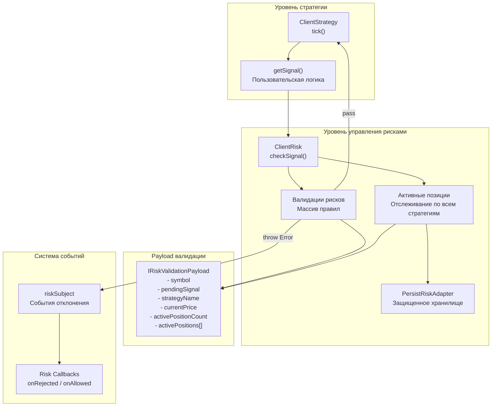
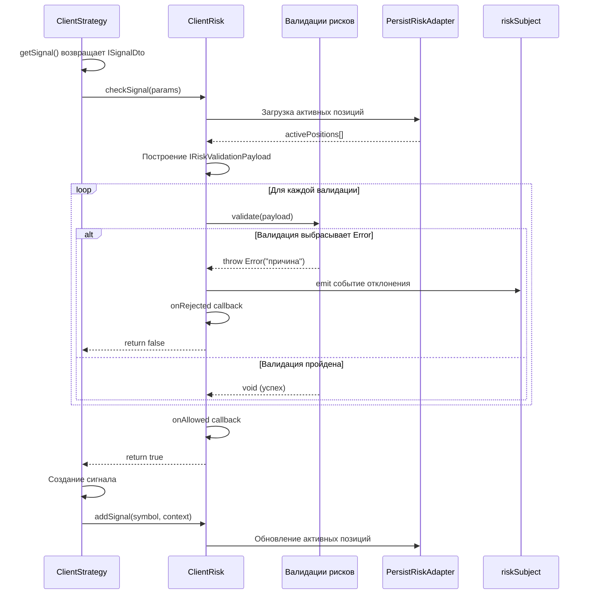

# Управление рисками

Это руководство объясняет систему управления рисками в backtest-kit, которая обеспечивает валидацию на уровне портфеля и отслеживание позиций для предотвращения чрезмерного риска.

## Что такое управление рисками?

Управление рисками в backtest-kit - это система валидации, которая проверяет сигналы **до** их создания, анализируя состояние всего портфеля. В отличие от валидации сигналов (которая проверяет отдельные параметры), управление рисками учитывает **все активные позиции** по всем стратегиям.

### Ключевые возможности

- ✅ Ограничения позиций на уровне портфеля
- ✅ Координация позиций между стратегиями
- ✅ Пользовательские правила валидации с заметками
- ✅ Фильтрация по символам
- ✅ Временные окна для торговли
- ✅ Инспекция активных позиций
- ✅ Защита от сбоев при отслеживании позиций
- ✅ События для отклоненных сигналов

---

## Архитектура управления рисками



### Поток выполнения

1. Стратегия вызывает `getSignal()` для генерации нового сигнала
2. `ClientRisk.checkSignal()` оценивает сигнал по правилам рисков
3. Каждая функция валидации получает `IRiskValidationPayload` с состоянием портфеля
4. Если любая валидация выбрасывает ошибку, сигнал **отклоняется** (не создается)
5. Отклонение генерирует событие в `riskSubject` с причиной
6. Если все валидации пройдены, сигнал создается и отслеживание позиций обновляется

---

## Регистрация профиля рисков

Профили рисков регистрируются через функцию `addRisk()`:

```typescript
import { addRisk } from "backtest-kit";

addRisk({
  riskName: "conservative",          // Уникальный идентификатор
  note: "Консервативный профиль",    // Опциональная документация
  validations: [                      // Массив правил валидации
    // Правила валидации здесь
  ],
  callbacks: {                        // Опциональные коллбэки
    onRejected: (symbol, params) => {
      console.warn(`Сигнал отклонен: ${symbol}`);
    },
    onAllowed: (symbol, params) => {
      console.log(`Сигнал разрешен: ${symbol}`);
    },
  },
});
```

### Структура схемы рисков

| Поле | Тип | Описание |
|------|-----|----------|
| `riskName` | `string` | Уникальный идентификатор профиля |
| `note` | `string?` | Опциональная документация |
| `validations` | `Array` | Массив правил валидации |
| `callbacks` | `object?` | Опциональные коллбэки событий |

---

## Payload валидации рисков

Каждая функция валидации получает объект `IRiskValidationPayload` с полным контекстом портфеля:

| Поле | Тип | Описание |
|------|-----|----------|
| `symbol` | `string` | Торговая пара (например, "BTCUSDT") |
| `pendingSignal` | `ISignalDto` | Сигнал для валидации |
| `strategyName` | `string` | Стратегия, запрашивающая сигнал |
| `exchangeName` | `string` | Название биржи |
| `currentPrice` | `number` | Текущая VWAP цена |
| `timestamp` | `number` | Текущая временная метка (мс) |
| `activePositionCount` | `number` | Всего активных позиций по всем стратегиям |
| `activePositions` | `Array` | Детальный список активных позиций |

### Структура активной позиции

```typescript
interface IRiskActivePosition {
  signal: ISignalRow;        // Полные данные сигнала
  strategyName: string;      // Стратегия владелец
  exchangeName: string;      // Название биржи
  openTimestamp: number;     // Когда позиция открылась (мс)
}
```

---

## Примеры правил валидации

### Пример 1: Ограничение одновременных позиций

```typescript
addRisk({
  riskName: "max-3-positions",
  note: "Максимум 3 одновременных позиции",
  validations: [
    ({ activePositionCount }) => {
      if (activePositionCount >= 3) {
        throw new Error("Достигнуто максимум 3 одновременных позиций");
      }
    }
  ]
});
```

**Когда применять**: Для ограничения общего количества открытых позиций и управления капиталом.

---

### Пример 2: Фильтрация по символам

```typescript
addRisk({
  riskName: "no-meme-coins",
  note: "Блокировка мем-коинов от торговли",
  validations: [
    ({ symbol }) => {
      const memeCoins = ["DOGEUSDT", "SHIBUSDT", "PEPEUSDT"];
      if (memeCoins.includes(symbol)) {
        throw new Error(`Мем-коин ${symbol} не разрешен`);
      }
    }
  ]
});
```

**Когда применять**: Для исключения определенных инструментов из торговли.

---

### Пример 3: Временные окна торговли

```typescript
addRisk({
  riskName: "trading-hours",
  note: "Торговля только в рабочие часы (9:00 - 17:00 UTC)",
  validations: [
    ({ timestamp }) => {
      const date = new Date(timestamp);
      const hour = date.getUTCHours();

      if (hour < 9 || hour >= 17) {
        throw new Error("Торговля разрешена только 9:00 - 17:00 UTC");
      }

      // Проверка дня недели (не торговать в выходные)
      const day = date.getUTCDay();
      if (day === 0 || day === 6) {
        throw new Error("Торговля не разрешена в выходные");
      }
    }
  ]
});
```

**Когда применять**: Для ограничения торговли определенными временными промежутками.

---

### Пример 4: Координация между стратегиями

```typescript
addRisk({
  riskName: "multi-strategy-coordinator",
  note: "Ограничение экспозиции на стратегию и проверка активных позиций",
  validations: [
    ({ activePositions, strategyName, symbol }) => {
      // Подсчет позиций для конкретной стратегии
      const strategyPositions = activePositions.filter(
        (pos) => pos.strategyName === strategyName
      );

      if (strategyPositions.length >= 2) {
        throw new Error(`Стратегия ${strategyName} уже имеет 2 позиции`);
      }

      // Проверка существующей позиции по этому символу
      const symbolPositions = activePositions.filter(
        (pos) => pos.signal.symbol === symbol
      );

      if (symbolPositions.length > 0) {
        const existingStrategy = symbolPositions[0].strategyName;
        throw new Error(`Позиция по ${symbol} уже открыта стратегией ${existingStrategy}`);
      }
    }
  ]
});
```

**Когда применять**: Для управления множественными стратегиями и предотвращения дублирования позиций.

---

### Пример 5: Валидация дистанции TP/SL

```typescript
addRisk({
  riskName: "tp-sl-distance",
  note: "Минимальная дистанция TP и соотношение риск/прибыль",
  validations: [
    {
      validate: ({ pendingSignal, currentPrice }) => {
        const { priceOpen = currentPrice, priceTakeProfit, position } = pendingSignal;
        const tpDistance = position === "long"
          ? ((priceTakeProfit - priceOpen) / priceOpen) * 100
          : ((priceOpen - priceTakeProfit) / priceOpen) * 100;

        if (tpDistance < 1) {
          throw new Error(`Дистанция TP ${tpDistance.toFixed(2)}% < 1%`);
        }
      },
      note: "Дистанция TP должна быть минимум 1%"
    },
    {
      validate: ({ pendingSignal, currentPrice }) => {
        const { priceOpen = currentPrice, priceTakeProfit, priceStopLoss, position } = pendingSignal;

        const reward = position === "long"
          ? priceTakeProfit - priceOpen
          : priceOpen - priceTakeProfit;

        const risk = position === "long"
          ? priceOpen - priceStopLoss
          : priceStopLoss - priceOpen;

        if (risk <= 0) {
          throw new Error("Некорректный SL: риск должен быть положительным");
        }

        const rrRatio = reward / risk;
        if (rrRatio < 2) {
          throw new Error(`Соотношение R/R ${rrRatio.toFixed(2)} < 2:1`);
        }
      },
      note: "Соотношение риск/прибыль должно быть минимум 1:2"
    }
  ]
});
```

**Когда применять**: Для обеспечения адекватного потенциала прибыли относительно риска.

---

### Пример 6: Максимальный риск на сделку

```typescript
addRisk({
  riskName: "max-risk-per-trade",
  note: "Максимум 2% риска на сделку",
  validations: [
    ({ pendingSignal, currentPrice }) => {
      const { priceOpen = currentPrice, priceStopLoss, position } = pendingSignal;

      const slDistance = position === "long"
        ? ((priceOpen - priceStopLoss) / priceOpen) * 100
        : ((priceStopLoss - priceOpen) / priceOpen) * 100;

      if (slDistance > 2) {
        throw new Error(`Дистанция SL ${slDistance.toFixed(2)}% > 2% максимального риска`);
      }
    }
  ]
});
```

**Когда применять**: Для ограничения максимального убытка на одну сделку.

---

## Связывание профиля рисков со стратегией

После регистрации профиля рисков, свяжите его со стратегией:

```typescript
import { addStrategy, addRisk } from "backtest-kit";

// Регистрация профиля рисков
addRisk({
  riskName: "conservative",
  validations: [
    ({ activePositionCount }) => {
      if (activePositionCount >= 3) {
        throw new Error("Максимум 3 позиции");
      }
    }
  ]
});

// Связывание со стратегией
addStrategy({
  strategyName: "macd-crossover",
  interval: "15m",
  riskName: "conservative",  // ← Связь с профилем рисков
  getSignal: async (symbol) => {
    // Логика стратегии
  },
});
```

---

## Мониторинг событий рисков

### Слушатель событий отклонения

```typescript
import { listenRisk } from "backtest-kit";

listenRisk((event) => {
  console.log("=== Сигнал отклонен ===");
  console.log(`Символ: ${event.symbol}`);
  console.log(`Стратегия: ${event.strategyName}`);
  console.log(`Причина: ${event.comment}`);
  console.log(`Активных позиций: ${event.activePositionCount}`);
  console.log(`Временная метка: ${new Date(event.timestamp).toISOString()}`);

  // Отправить уведомление
  sendAlert(`Сигнал отклонен: ${event.comment}`);
});
```

### Структура события риска

```typescript
interface RiskContract {
  symbol: string;              // Торговая пара
  strategyName: string;        // Название стратегии
  exchangeName: string;        // Название биржи
  activePositionCount: number; // Количество активных позиций
  comment: string;             // Причина отклонения
  timestamp: number;           // Временная метка (мс)
  pendingSignal: ISignalDto;   // Отклоненный сигнал
}
```

---

## Использование коллбэков

```typescript
addRisk({
  riskName: "monitored-risk",
  validations: [
    ({ activePositionCount }) => {
      if (activePositionCount >= 5) {
        throw new Error("Достигнуто максимум 5 позиций");
      }
    }
  ],
  callbacks: {
    onRejected: (symbol, params) => {
      console.warn(`⚠️ Сигнал отклонен для ${symbol}`);
      console.warn(`   Причина: ${params.comment}`);
      console.warn(`   Активных позиций: ${params.activePositionCount}`);

      // Логировать в базу данных
      logRiskRejection({
        symbol,
        strategy: params.strategyName,
        reason: params.comment,
        timestamp: params.timestamp,
      });
    },
    onAllowed: (symbol, params) => {
      console.log(`✓ Сигнал разрешен для ${symbol}`);
      console.log(`   Стратегия: ${params.strategyName}`);
      console.log(`   Активных позиций после: ${params.activePositionCount + 1}`);
    },
  },
});
```

---

## Диаграмма потока проверки рисков



---

## Инспекция активных позиций

```typescript
addRisk({
  riskName: "position-inspector",
  note: "Детальная инспекция активных позиций",
  validations: [
    ({ activePositions, symbol, strategyName }) => {
      // Вывести все активные позиции
      console.log(`\n=== Активные позиции (всего: ${activePositions.length}) ===`);

      activePositions.forEach((pos, index) => {
        console.log(`\nПозиция ${index + 1}:`);
        console.log(`  Стратегия: ${pos.strategyName}`);
        console.log(`  Символ: ${pos.signal.symbol}`);
        console.log(`  Направление: ${pos.signal.position}`);
        console.log(`  Вход: ${pos.signal.priceOpen}`);
        console.log(`  TP: ${pos.signal.priceTakeProfit}`);
        console.log(`  SL: ${pos.signal.priceStopLoss}`);
        console.log(`  Открыта: ${new Date(pos.openTimestamp).toISOString()}`);
      });

      // Проверка коррелированных позиций
      const longCount = activePositions.filter(p => p.signal.position === "long").length;
      const shortCount = activePositions.filter(p => p.signal.position === "short").length;

      if (longCount > 0 && shortCount > 0) {
        console.warn(`⚠️ Предупреждение: ${longCount} LONG и ${shortCount} SHORT позиций одновременно`);
      }

      // Проверка на чрезмерную концентрацию
      const btcPositions = activePositions.filter(p => p.signal.symbol.includes("BTC")).length;
      if (btcPositions >= 2) {
        throw new Error(`Слишком много BTC позиций: ${btcPositions}`);
      }
    }
  ]
});
```

---

## Постоянство рисков (Live Trading)

В режиме live trading активные позиции сохраняются на диск через `PersistRiskAdapter`:

```typescript
// Автоматически сохраняется при открытии позиции
// Путь: ./data/risk/{symbol}-{strategyName}.json

// Структура сохраненных данных
{
  "activePositions": [
    {
      "signal": { /* данные сигнала */ },
      "strategyName": "macd-crossover",
      "exchangeName": "binance-live",
      "openTimestamp": 1702800000000
    }
  ]
}
```

**Гарантии**:
- Атомарная запись (защита от повреждения)
- Автоматическое восстановление при перезапуске
- Синхронизация со всеми активными позициями

---

## Полный пример: Производственный профиль рисков

```typescript
import { addRisk, listenRisk } from "backtest-kit";

// Комплексный профиль рисков для продакшена
addRisk({
  riskName: "production-risk",
  note: "Производственный профиль с множественными проверками безопасности",
  validations: [
    // 1. Ограничение общих позиций
    {
      validate: ({ activePositionCount }) => {
        if (activePositionCount >= 3) {
          throw new Error("Максимум 3 одновременных позиции");
        }
      },
      note: "Лимит портфеля: 3 позиции"
    },

    // 2. Максимум риска на сделку
    {
      validate: ({ pendingSignal, currentPrice }) => {
        const { priceOpen = currentPrice, priceStopLoss, position } = pendingSignal;
        const slDistance = position === "long"
          ? ((priceOpen - priceStopLoss) / priceOpen) * 100
          : ((priceStopLoss - priceOpen) / priceOpen) * 100;

        if (slDistance > 2) {
          throw new Error(`Риск ${slDistance.toFixed(2)}% > 2% лимита`);
        }
      },
      note: "Максимум 2% риска на сделку"
    },

    // 3. Минимальное соотношение риск/прибыль
    {
      validate: ({ pendingSignal, currentPrice }) => {
        const { priceOpen = currentPrice, priceTakeProfit, priceStopLoss, position } = pendingSignal;

        const reward = position === "long"
          ? priceTakeProfit - priceOpen
          : priceOpen - priceTakeProfit;

        const risk = position === "long"
          ? priceOpen - priceStopLoss
          : priceStopLoss - priceOpen;

        const rrRatio = reward / risk;
        if (rrRatio < 2) {
          throw new Error(`R/R ${rrRatio.toFixed(2)} < 2:1`);
        }
      },
      note: "Минимум 1:2 риск/прибыль"
    },

    // 4. Временные окна
    {
      validate: ({ timestamp }) => {
        const date = new Date(timestamp);
        const hour = date.getUTCHours();

        // Не торговать ночью (0:00 - 6:00 UTC)
        if (hour >= 0 && hour < 6) {
          throw new Error("Торговля приостановлена в ночные часы");
        }
      },
      note: "Запрет ночной торговли"
    },

    // 5. Координация стратегий
    {
      validate: ({ activePositions, strategyName, symbol }) => {
        // Максимум 1 позиция на стратегию
        const strategyPositions = activePositions.filter(
          p => p.strategyName === strategyName
        );
        if (strategyPositions.length >= 1) {
          throw new Error(`Стратегия ${strategyName} уже имеет позицию`);
        }

        // Не дублировать позиции по символу
        const symbolPositions = activePositions.filter(
          p => p.signal.symbol === symbol
        );
        if (symbolPositions.length > 0) {
          throw new Error(`Позиция по ${symbol} уже существует`);
        }
      },
      note: "Предотвращение дублирования позиций"
    },

    // 6. Фильтр волатильных инструментов
    {
      validate: ({ symbol }) => {
        const highVolatility = ["BTCUSDT", "ETHUSDT"];
        const lowLiquidity = ["PEPEUSDT", "SHIBUSDT"];

        if ([...highVolatility, ...lowLiquidity].includes(symbol)) {
          // Можно торговать, но с предупреждением
          console.warn(`⚠️ Внимание: ${symbol} - высокая волатильность/низкая ликвидность`);
        }
      },
      note: "Предупреждение о волатильных инструментах"
    },
  ],
  callbacks: {
    onRejected: (symbol, params) => {
      console.error(`❌ СИГНАЛ ОТКЛОНЕН: ${symbol}`);
      console.error(`   Причина: ${params.comment}`);
      console.error(`   Стратегия: ${params.strategyName}`);
      console.error(`   Активных позиций: ${params.activePositionCount}`);

      // Отправить критическое уведомление
      sendCriticalAlert({
        type: "RISK_REJECTION",
        symbol,
        reason: params.comment,
        timestamp: params.timestamp,
      });
    },
    onAllowed: (symbol, params) => {
      console.log(`✓ Сигнал разрешен: ${symbol}`);
      console.log(`   Стратегия: ${params.strategyName}`);
    },
  },
});

// Мониторинг всех отклонений
listenRisk((event) => {
  console.log("\n=== РИСК СОБЫТИЕ ===");
  console.log(`Символ: ${event.symbol}`);
  console.log(`Стратегия: ${event.strategyName}`);
  console.log(`Причина отклонения: ${event.comment}`);
  console.log(`Активных позиций: ${event.activePositionCount}`);
  console.log(`Время: ${new Date(event.timestamp).toISOString()}`);

  // Логирование в базу данных
  logRiskEvent({
    symbol: event.symbol,
    strategy: event.strategyName,
    reason: event.comment,
    activePositions: event.activePositionCount,
    timestamp: event.timestamp,
    signal: event.pendingSignal,
  });
});
```

---

## Тестирование правил рисков

```typescript
import { addRisk, addStrategy, Backtest } from "backtest-kit";

// Создание тестового профиля рисков
addRisk({
  riskName: "test-risk",
  validations: [
    ({ activePositionCount }) => {
      console.log(`Проверка: активных позиций = ${activePositionCount}`);
      if (activePositionCount >= 2) {
        throw new Error("Тест: максимум 2 позиции");
      }
    }
  ],
  callbacks: {
    onRejected: (symbol, params) => {
      console.log(`✓ Тест пройден: сигнал корректно отклонен`);
    },
    onAllowed: (symbol, params) => {
      console.log(`✓ Тест пройден: сигнал корректно разрешен`);
    },
  },
});

// Тестовая стратегия
addStrategy({
  strategyName: "test-strategy",
  interval: "5m",
  riskName: "test-risk",
  getSignal: async (symbol) => {
    // Генерация тестовых сигналов
    return {
      position: "long",
      priceOpen: 50000,
      priceTakeProfit: 51000,
      priceStopLoss: 49000,
      minuteEstimatedTime: 60,
      timestamp: Date.now(),
    };
  },
});

// Запуск теста
await Backtest.background("BTCUSDT", {
  strategyName: "test-strategy",
  exchangeName: "test-exchange",
  frameName: "test-frame",
});
```

---

## Следующие шаги

После настройки управления рисками:

1. **[AI оптимизация стратегий](06-ai-optimization.md)** - генерация стратегий с использованием больших языковых моделей
