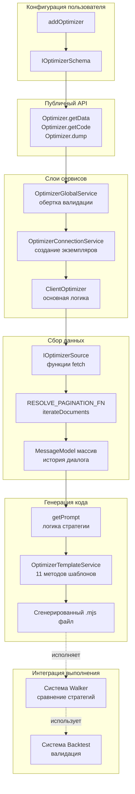
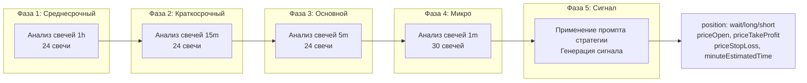

# AI Оптимизация стратегий

Это руководство объясняет, как использовать систему Optimizer в backtest-kit для генерации торговых стратегий с помощью больших языковых моделей (LLM). Вы узнаете, как настроить Ollama, создать источники данных и сгенерировать полностью исполняемые стратегии.

## Что такое Optimizer?

Optimizer - это система генерации стратегий мета-уровня, которая использует LLM для создания торговой логики на основе исторических данных. В отличие от режимов Backtest, Live и Walker, которые исполняют существующие стратегии, Optimizer создает новые стратегии, анализируя данные и генерируя код.

### Ключевые возможности

- 🤖 **LLM-генерация** - Использует Ollama для синтеза стратегий
- 📊 **Мультиисточники данных** - Собирает данные из различных источников
- 📅 **Множественные временные диапазоны** - Генерирует варианты стратегий для разных периодов
- 🔄 **Интеграция с Walker** - Автоматическое сравнение сгенерированных стратегий
- 💾 **Полностью исполняемый код** - Генерирует готовые к запуску `.mjs` файлы

---

## Установка Ollama

### Шаг 1: Установка Ollama

**Windows:**
```bash
# Скачайте установщик с официального сайта
https://ollama.ai/download/windows

# Или используйте winget
winget install Ollama.Ollama
```

**macOS:**
```bash
# Используйте Homebrew
brew install ollama
```

**Linux:**
```bash
# Используйте curl
curl -fsSL https://ollama.ai/install.sh | sh
```

### Шаг 2: Установка модели

```bash
# Запустите Ollama сервер (если не запущен автоматически)
ollama serve

# Установите модель deepseek-v3.1 (рекомендуется для торговых стратегий)
ollama pull deepseek-v3.1

# Или используйте другие модели
ollama pull llama3
ollama pull mistral
```

### Шаг 3: Проверка установки

```bash
# Протестируйте модель
ollama run deepseek-v3.1
>>> Привет, ты работаешь?
>>> (Ctrl+D для выхода)
```

### Шаг 4: Настройка переменных окружения

```bash
# В .env файле
OLLAMA_HOST=http://localhost:11434
OLLAMA_MODEL=deepseek-v3.1
```

---

## Архитектура системы Optimizer



---

## Создание оптимизатора

### Базовая конфигурация

```typescript
import { addOptimizer } from "backtest-kit";

addOptimizer({
  optimizerName: "crypto-optimizer",
  note: "Генератор стратегий для криптовалют",

  // Временные диапазоны для обучения
  rangeTrain: [
    {
      startDate: new Date("2025-01-01"),
      endDate: new Date("2025-01-15"),
    },
    {
      startDate: new Date("2025-02-01"),
      endDate: new Date("2025-02-15"),
    },
  ],

  // Временной диапазон для тестирования
  rangeTest: {
    startDate: new Date("2025-03-01"),
    endDate: new Date("2025-03-15"),
  },

  // Источники данных
  source: [
    // Источники данных здесь
  ],

  // Генератор промпта
  getPrompt: async (symbol, messages) => {
    // Логика генерации промпта здесь
  },
});
```

---

## Источники данных

Источники данных - это функции, которые извлекают информацию для обучения LLM.

### Пример 1: Источник новостей

```typescript
import { addOptimizer } from "backtest-kit";

addOptimizer({
  optimizerName: "news-based-optimizer",
  rangeTrain: [
    {
      startDate: new Date("2025-01-01"),
      endDate: new Date("2025-01-31"),
    },
  ],
  rangeTest: {
    startDate: new Date("2025-02-01"),
    endDate: new Date("2025-02-28"),
  },

  // Источник новостей
  source: [
    {
      name: "crypto-news",
      fetch: async ({ symbol, startDate, endDate, limit, offset }) => {
        // Вызов API новостей
        const response = await fetch(
          `https://api.cryptonews.com/v1/news?` +
          `symbol=${symbol}&` +
          `start=${startDate.getTime()}&` +
          `end=${endDate.getTime()}&` +
          `limit=${limit}&` +
          `offset=${offset}`
        );

        const news = await response.json();

        return news.articles.map(article => ({
          id: article.id,
          title: article.title,
          content: article.content,
          timestamp: article.publishedAt,
          sentiment: article.sentiment,
        }));
      },

      // Форматирование для пользовательского сообщения
      user: async (symbol, data, sourceName) => {
        return `Вот новости о ${symbol}:\n\n` +
          data.map(article =>
            `[${new Date(article.timestamp).toISOString()}] ${article.title}\n` +
            `Настроение: ${article.sentiment}\n` +
            `${article.content.substring(0, 200)}...\n`
          ).join('\n');
      },

      // Форматирование для ответа ассистента
      assistant: async (symbol, data, sourceName) => {
        const positiveSentiment = data.filter(a => a.sentiment > 0).length;
        const negativeSentiment = data.filter(a => a.sentiment < 0).length;

        return `Проанализировал ${data.length} новостей о ${symbol}.\n` +
          `Позитивных: ${positiveSentiment}, Негативных: ${negativeSentiment}.\n` +
          `Общее настроение: ${positiveSentiment > negativeSentiment ? 'бычье' : 'медвежье'}.`;
      },
    },
  ],

  getPrompt: async (symbol, messages) => {
    return `На основе проанализированных новостей, создай торговую стратегию для ${symbol}.`;
  },
});
```

### Пример 2: Источник технических индикаторов

```typescript
import { SMA, RSI, MACD } from "technicalindicators";
import { addOptimizer } from "backtest-kit";

addOptimizer({
  optimizerName: "technical-optimizer",
  rangeTrain: [
    {
      startDate: new Date("2025-01-01"),
      endDate: new Date("2025-01-31"),
    },
  ],
  rangeTest: {
    startDate: new Date("2025-02-01"),
    endDate: new Date("2025-02-28"),
  },

  source: [
    {
      name: "technical-indicators",
      fetch: async ({ symbol, startDate, endDate, limit, offset }) => {
        // Получить исторические свечи
        const exchange = new ccxt.binance();
        const ohlcv = await exchange.fetchOHLCV(
          symbol,
          "1h",
          startDate.getTime(),
          100
        );

        const closes = ohlcv.map(c => c[4]);

        // Рассчитать индикаторы
        const sma20 = SMA.calculate({ period: 20, values: closes });
        const sma50 = SMA.calculate({ period: 50, values: closes });
        const rsi = RSI.calculate({ period: 14, values: closes });
        const macd = MACD.calculate({
          values: closes,
          fastPeriod: 12,
          slowPeriod: 26,
          signalPeriod: 9,
          SimpleMAOscillator: false,
          SimpleMASignal: false,
        });

        return [{
          id: `${symbol}-${startDate.getTime()}`,
          symbol,
          timestamp: Date.now(),
          indicators: {
            sma20: sma20[sma20.length - 1],
            sma50: sma50[sma50.length - 1],
            rsi: rsi[rsi.length - 1],
            macd: macd[macd.length - 1],
          },
          candles: ohlcv.slice(-24),
        }];
      },

      user: async (symbol, data, sourceName) => {
        const latest = data[data.length - 1];
        return `Текущие индикаторы для ${symbol}:\n` +
          `SMA(20): ${latest.indicators.sma20?.toFixed(2)}\n` +
          `SMA(50): ${latest.indicators.sma50?.toFixed(2)}\n` +
          `RSI(14): ${latest.indicators.rsi?.toFixed(2)}\n` +
          `MACD: ${latest.indicators.macd?.MACD?.toFixed(2)}\n` +
          `Signal: ${latest.indicators.macd?.signal?.toFixed(2)}`;
      },

      assistant: async (symbol, data, sourceName) => {
        const latest = data[data.length - 1];
        const trend = latest.indicators.sma20 > latest.indicators.sma50 ? "восходящий" : "нисходящий";
        const rsiStatus = latest.indicators.rsi > 70 ? "перекуплен" : latest.indicators.rsi < 30 ? "перепродан" : "нейтральный";

        return `Анализ индикаторов:\nТренд: ${trend}\nRSI: ${rsiStatus}`;
      },
    },
  ],

  getPrompt: async (symbol, messages) => {
    return `На основе технических индикаторов, создай стратегию для торговли ${symbol}.` +
      `Используй комбинацию SMA кроссоверов, RSI для определения зон перекупленности/перепроданности,` +
      `и MACD для подтверждения тренда.`;
  },
});
```

---

## Генератор промпта

Функция `getPrompt` получает всю собранную информацию и создает финальную инструкцию для LLM.

```typescript
import { addOptimizer } from "backtest-kit";
import { Ollama } from "ollama";

addOptimizer({
  optimizerName: "advanced-optimizer",
  rangeTrain: [/* ... */],
  rangeTest: {/* ... */},
  source: [/* ... */],

  getPrompt: async (symbol, messages) => {
    // messages - массив всех сообщений из источников данных

    // Можно использовать LLM для генерации промпта
    const ollama = new Ollama({ host: process.env.OLLAMA_HOST });

    const summaryResponse = await ollama.chat({
      model: process.env.OLLAMA_MODEL || "deepseek-v3.1",
      messages: [
        {
          role: "user",
          content: "Проанализируй следующую информацию о рынке и создай краткое резюме:\n\n" +
            messages.map(m => `${m.role}: ${m.content}`).join('\n\n')
        },
      ],
    });

    const summary = summaryResponse.message.content;

    // Создание финального промпта стратегии
    return `Ты - эксперт по криптовалютной торговле.

На основе следующего анализа рынка:
${summary}

Создай торговую стратегию для ${symbol} со следующими характеристиками:

1. НАПРАВЛЕНИЕ ВХОДА: Определи, когда открывать LONG или SHORT позиции
2. ТОЧКА ВХОДА: Определи оптимальную цену входа (используй priceOpen если нужен отложенный вход)
3. ТЕЙК-ПРОФИТ: Целевая цена для фиксации прибыли (минимум +2% от входа)
4. СТОП-ЛОСС: Защитный уровень (максимум -1.5% от входа)
5. ВРЕМЯ ЖИЗНИ: Максимальное время удержания позиции в минутах

ВАЖНО: Соотношение риск/прибыль должно быть минимум 1:2.

Верни результат в формате JSON:
{
  "position": "long" | "short" | "wait",
  "priceOpen": number | undefined,
  "priceTakeProfit": number,
  "priceStopLoss": number,
  "minuteEstimatedTime": number
}

Если нет четкого сигнала, используй "position": "wait".`;
  },
});
```

---

## Запуск оптимизации

### Метод 1: Получение данных

```typescript
import { Optimizer } from "backtest-kit";

// Сбор данных и генерация стратегий
const strategies = await Optimizer.getData("BTCUSDT", {
  optimizerName: "crypto-optimizer",
});

console.log(`Сгенерировано стратегий: ${strategies.length}`);

strategies.forEach((strategy, index) => {
  console.log(`\nСтратегия ${index + 1}:`);
  console.log(`  Название: ${strategy.name}`);
  console.log(`  Символ: ${strategy.symbol}`);
  console.log(`  Промпт:\n${strategy.strategy}`);
});
```

### Метод 2: Генерация кода

```typescript
import { Optimizer } from "backtest-kit";

// Генерация полного исполняемого кода
const code = await Optimizer.getCode("BTCUSDT", {
  optimizerName: "crypto-optimizer",
});

console.log("Сгенерированный код:");
console.log(code);

// Код включает:
// - Импорты и настройки
// - Функции для работы с LLM
// - Настройку биржи
// - Фреймы для обучения и тестирования
// - Сгенерированные стратегии
// - Конфигурацию Walker для сравнения
// - Слушатели событий и запуск
```

### Метод 3: Сохранение в файл

```typescript
import { Optimizer, listenOptimizerProgress } from "backtest-kit";

// Мониторинг прогресса
listenOptimizerProgress((event) => {
  const percent = (event.progress * 100).toFixed(1);
  console.log(`Прогресс: ${percent}% - ${event.comment}`);
});

// Сохранение сгенерированного кода в файл
await Optimizer.dump("BTCUSDT", {
  optimizerName: "crypto-optimizer",
});

// Файл сохранен в: ./dump/optimizer/crypto-optimizer_BTCUSDT.mjs
console.log("Код сохранен в ./dump/optimizer/crypto-optimizer_BTCUSDT.mjs");

// Теперь можно запустить сгенерированную стратегию:
// node ./dump/optimizer/crypto-optimizer_BTCUSDT.mjs
```

---

## Структура сгенерированного кода

Optimizer генерирует полностью готовый к выполнению `.mjs` файл со следующей структурой:

```javascript
#!/usr/bin/env node

// 1. Импорты
import { Ollama } from "ollama";
import ccxt from "ccxt";
import {
  addExchange,
  addFrame,
  addStrategy,
  addWalker,
  Walker,
  listenWalkerProgress,
  listenDoneWalker,
} from "backtest-kit";

// 2. Константы
const OLLAMA_HOST = process.env.OLLAMA_HOST || "http://localhost:11434";
const OLLAMA_MODEL = process.env.OLLAMA_MODEL || "deepseek-v3.1";
const ollama = new Ollama({ host: OLLAMA_HOST });

// 3. Вспомогательные функции для работы с LLM
async function text(messages) { /* ... */ }
async function json(messages) { /* ... */ }
async function dumpJson(resultId, history, result) { /* ... */ }

// 4. Настройка биржи
addExchange({
  exchangeName: "a7x3k_exchange",
  getCandles: async (symbol, interval, since, limit) => { /* ... */ },
  formatPrice: async (symbol, price) => { /* ... */ },
  formatQuantity: async (symbol, quantity) => { /* ... */ },
});

// 5. Фреймы для обучения
addFrame({
  frameName: "a7x3k_train_frame-1",
  interval: "5m",
  startDate: new Date("2025-01-01"),
  endDate: new Date("2025-01-15"),
});

addFrame({
  frameName: "a7x3k_train_frame-2",
  interval: "5m",
  startDate: new Date("2025-02-01"),
  endDate: new Date("2025-02-15"),
});

// 6. Фрейм для тестирования
addFrame({
  frameName: "a7x3k_test_frame",
  interval: "5m",
  startDate: new Date("2025-03-01"),
  endDate: new Date("2025-03-15"),
});

// 7. Сгенерированные стратегии
addStrategy({
  strategyName: "a7x3k_strategy-1",
  interval: "5m",
  getSignal: async (symbol) => {
    // Мультитаймфреймовый анализ
    const messages = [];

    // Загрузка свечей разных таймфреймов
    const microTermCandles = await getCandles(symbol, "1m", 30);
    const mainTermCandles = await getCandles(symbol, "5m", 24);
    const shortTermCandles = await getCandles(symbol, "15m", 24);
    const mediumTermCandles = await getCandles(symbol, "1h", 24);

    // Анализ каждого таймфрейма
    messages.push(
      { role: "user", content: "Проанализируй свечи 1h..." },
      { role: "assistant", content: "Тренд 1h проанализирован" }
    );

    // ... анализ других таймфреймов ...

    // Генерация сигнала
    messages.push({
      role: "user",
      content: "Сгенерируй торговый сигнал: " + strategyPrompt
    });

    const result = await json(messages);
    await dumpJson("strategy-1", messages, result);

    return result;
  },
});

// 8. Конфигурация Walker для сравнения
addWalker({
  walkerName: "a7x3k_walker",
  exchangeName: "a7x3k_exchange",
  frameName: "a7x3k_test_frame",
  strategies: [
    { strategyName: "a7x3k_strategy-1", symbols: ["BTCUSDT"] },
    { strategyName: "a7x3k_strategy-2", symbols: ["BTCUSDT"] },
  ],
});

// 9. Слушатели событий и запуск
listenWalkerProgress((event) => {
  console.log(`Прогресс: ${(event.progress * 100).toFixed(1)}%`);
});

listenDoneWalker(async (event) => {
  console.log("Сравнение стратегий завершено");
  await Walker.dump(event.symbol, event.walkerName);
});

// Запуск Walker
Walker.background("BTCUSDT", {
  walkerName: "a7x3k_walker",
});
```

---

## Мультитаймфреймовый анализ

Сгенерированные стратегии используют 4-фазный паттерн анализа:



---

## Мониторинг прогресса

```typescript
import { listenOptimizerProgress, Optimizer } from "backtest-kit";

// Детальный мониторинг
listenOptimizerProgress((event) => {
  console.log("\n=== Прогресс оптимизации ===");
  console.log(`Символ: ${event.symbol}`);
  console.log(`Оптимизатор: ${event.optimizerName}`);
  console.log(`Прогресс: ${(event.progress * 100).toFixed(1)}%`);
  console.log(`Статус: ${event.comment}`);
  console.log(`Временная метка: ${new Date(event.timestamp).toISOString()}`);
});

// Запуск с мониторингом
await Optimizer.dump("BTCUSDT", {
  optimizerName: "crypto-optimizer",
});
```

---

## Полный пример: Продвинутый оптимизатор

```typescript
import { config } from "dotenv";
import ccxt from "ccxt";
import { Ollama } from "ollama";
import {
  setLogger,
  addOptimizer,
  Optimizer,
  listenOptimizerProgress,
} from "backtest-kit";

// Загрузка переменных окружения
config();

// Настройка логгера
setLogger({
  log: console.log,
  debug: console.debug,
  info: console.info,
  warn: console.warn,
});

// Создание оптимизатора
addOptimizer({
  optimizerName: "advanced-crypto-optimizer",
  note: "Продвинутый генератор стратегий с множественными источниками данных",

  rangeTrain: [
    {
      startDate: new Date("2025-01-01"),
      endDate: new Date("2025-01-15"),
    },
    {
      startDate: new Date("2025-01-16"),
      endDate: new Date("2025-01-31"),
    },
    {
      startDate: new Date("2025-02-01"),
      endDate: new Date("2025-02-15"),
    },
  ],

  rangeTest: {
    startDate: new Date("2025-03-01"),
    endDate: new Date("2025-03-31"),
  },

  source: [
    // Источник 1: Технические индикаторы
    {
      name: "technical-analysis",
      fetch: async ({ symbol, startDate, endDate, limit, offset }) => {
        const exchange = new ccxt.binance();
        const ohlcv = await exchange.fetchOHLCV(
          symbol,
          "1h",
          startDate.getTime(),
          100
        );

        const closes = ohlcv.map(c => c[4]);

        return [{
          id: `tech-${symbol}-${startDate.getTime()}`,
          timestamp: Date.now(),
          candles: ohlcv,
          indicators: {
            // Расчет индикаторов
            sma20: calculateSMA(closes, 20),
            rsi: calculateRSI(closes, 14),
            macd: calculateMACD(closes),
          },
        }];
      },
      user: async (symbol, data) => {
        return `Технический анализ ${symbol}:\n${JSON.stringify(data[0].indicators, null, 2)}`;
      },
      assistant: async () => {
        return "Технический анализ проанализирован.";
      },
    },

    // Источник 2: Объемы торгов
    {
      name: "volume-analysis",
      fetch: async ({ symbol, startDate, endDate }) => {
        const exchange = new ccxt.binance();
        const trades = await exchange.fetchTrades(symbol, startDate.getTime(), 1000);

        return [{
          id: `volume-${symbol}-${startDate.getTime()}`,
          totalVolume: trades.reduce((sum, t) => sum + t.amount, 0),
          avgPrice: trades.reduce((sum, t) => sum + t.price, 0) / trades.length,
          buyPressure: trades.filter(t => t.side === "buy").length / trades.length,
        }];
      },
      user: async (symbol, data) => {
        return `Анализ объемов ${symbol}: Давление покупателей ${(data[0].buyPressure * 100).toFixed(1)}%`;
      },
      assistant: async () => {
        return "Анализ объемов завершен.";
      },
    },
  ],

  getPrompt: async (symbol, messages) => {
    const ollama = new Ollama({ host: process.env.OLLAMA_HOST });

    // Генерация сводки с помощью LLM
    const summaryResponse = await ollama.chat({
      model: "deepseek-v3.1",
      messages: [
        {
          role: "user",
          content: "Создай краткую сводку анализа рынка:\n\n" +
            messages.map(m => `${m.role}: ${m.content}`).join('\n\n')
        },
      ],
    });

    const summary = summaryResponse.message.content;

    return `Ты - эксперт по криптовалютной торговле.

АНАЛИЗ РЫНКА:
${summary}

ЗАДАЧА: Создай торговую стратегию для ${symbol}.

ТРЕБОВАНИЯ:
1. Используй комбинацию технических индикаторов и анализа объемов
2. Определи четкие условия входа (LONG/SHORT)
3. Установи тейк-профит минимум +2% от входа
4. Установи стоп-лосс максимум -1.5% от входа
5. Соотношение риск/прибыль должно быть минимум 1:2

ФОРМАТ ОТВЕТА (JSON):
{
  "position": "long" | "short" | "wait",
  "priceOpen": number | undefined,
  "priceTakeProfit": number,
  "priceStopLoss": number,
  "minuteEstimatedTime": number
}`;
  },
});

// Мониторинг прогресса
listenOptimizerProgress((event) => {
  const percent = (event.progress * 100).toFixed(1);
  console.log(`[${percent}%] ${event.comment}`);
});

// Запуск генерации
console.log("Запуск AI оптимизации стратегий...\n");

await Optimizer.dump("BTCUSDT", {
  optimizerName: "advanced-crypto-optimizer",
});

console.log("\n✓ Генерация завершена!");
console.log("Сгенерированный файл: ./dump/optimizer/advanced-crypto-optimizer_BTCUSDT.mjs");
console.log("\nЗапустите сгенерированную стратегию:");
console.log("node ./dump/optimizer/advanced-crypto-optimizer_BTCUSDT.mjs");
```

---

## Запуск сгенерированной стратегии

```bash
# После генерации, запустите файл
node ./dump/optimizer/advanced-crypto-optimizer_BTCUSDT.mjs

# Вывод:
# Запуск Walker для сравнения стратегий...
# [10.0%] Выполнение стратегии advanced-crypto-optimizer-strategy-1
# [20.0%] Выполнение стратегии advanced-crypto-optimizer-strategy-2
# [30.0%] Выполнение стратегии advanced-crypto-optimizer-strategy-3
# ...
# [100%] Сравнение завершено
# Отчет сохранен: ./dump/walker/advanced-crypto-optimizer_walker.md
```

---

## Рекомендации

### 1. Выбор модели

```typescript
// Для быстрого прототипирования
OLLAMA_MODEL=llama3

// Для продвинутого анализа (рекомендуется)
OLLAMA_MODEL=deepseek-v3.1

// Для балансасоотношения скорости и качества
OLLAMA_MODEL=mistral
```

### 2. Размер обучающих данных

```typescript
// Минимум 2 диапазона обучения
rangeTrain: [
  { startDate: new Date("2025-01-01"), endDate: new Date("2025-01-15") },
  { startDate: new Date("2025-02-01"), endDate: new Date("2025-02-15") },
]

// Оптимально 3-5 диапазонов
rangeTrain: [
  // Январь
  // Февраль
  // Март
  // Апрель
  // Май
]
```

### 3. Качество промптов

```typescript
// Плохой промпт
getPrompt: async (symbol, messages) => {
  return "Создай стратегию";
}

// Хороший промпт
getPrompt: async (symbol, messages) => {
  return `Ты - эксперт по торговле ${symbol}.

На основе следующего анализа: ${summary}

Создай стратегию со следующими характеристиками:
- Четкие условия входа
- TP минимум +2%
- SL максимум -1.5%
- Соотношение R/R минимум 1:2

Формат ответа: JSON...`;
}
```

---

## Заключение

Система Optimizer в backtest-kit предоставляет мощный инструмент для генерации торговых стратегий с использованием AI. Комбинируя множественные источники данных, мультитаймфреймовый анализ и продвинутые LLM модели, вы можете создавать, тестировать и сравнивать стратегии автоматически.

## Следующие шаги

После получения оптимальной торговой стратегии:

1. **[LLM Трейдинг со структурированным JSON выводом](07-llm-trading.md)** - использование LLM как интерпретатора торговых стратегий на естественном языке
