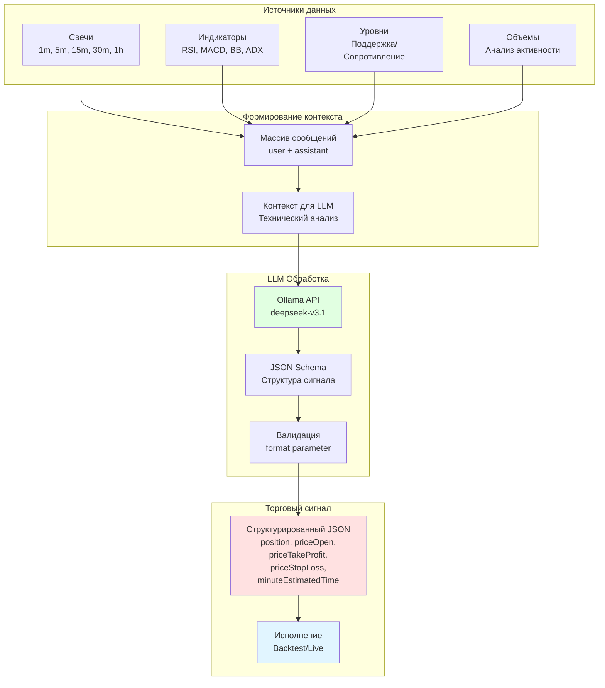

# LLM Трейдинг со структурированным JSON выводом

Это продвинутое руководство объясняет, как использовать большие языковые модели (LLM) напрямую в торговых стратегиях для генерации сигналов в реальном времени. Вы узнаете, как настроить Ollama для структурированного JSON вывода и интегрировать AI анализ в процесс принятия торговых решений.

## Что такое LLM трейдинг?

LLM трейдинг - это подход, при котором большая языковая модель анализирует рыночные данные и генерирует торговые сигналы в реальном времени. В отличие от традиционных стратегий с фиксированными правилами, LLM может адаптировать свой анализ к меняющимся рыночным условиям.

### Преимущества LLM трейдинга

- 🧠 **Адаптивность** - модель может учитывать контекст и нюансы рынка
- 📊 **Мультифакторный анализ** - одновременный анализ десятков индикаторов
- 🔄 **Непрерывное обучение** - возможность дообучения на новых данных
- 💡 **Объяснимость** - модель может объяснить причины своих решений
- ⚡ **Быстрая адаптация** - легко изменить стратегию через промпт

---

## Архитектура LLM трейдинга



---

## Настройка Ollama для структурированного вывода

### Шаг 1: Установка и настройка

```bash
# Установка Ollama (если еще не установлен)
# Windows
winget install Ollama.Ollama

# macOS
brew install ollama

# Linux
curl -fsSL https://ollama.ai/install.sh | sh
```

```bash
# Запуск сервера
ollama serve

# Установка модели deepseek-v3.1 (рекомендуется для трейдинга)
ollama pull deepseek-v3.1
```

### Шаг 2: Настройка переменных окружения

```bash
# .env файл
OLLAMA_HOST=http://localhost:11434
OLLAMA_MODEL=deepseek-v3.1

# Для облачного Ollama
OLLAMA_API_KEY=your_api_key_here
OLLAMA_HOST=https://ollama.com
```

---

## Функция для структурированного JSON вывода

### Базовая реализация

```typescript
import { Ollama } from "ollama";

async function json(messages) {
  const ollama = new Ollama({
    host: process.env.OLLAMA_HOST || "http://localhost:11434",
  });

  const response = await ollama.chat({
    model: process.env.OLLAMA_MODEL || "deepseek-v3.1",
    messages: [
      {
        role: "system",
        content: [
          "Проанализируй торговую стратегию и верни торговый сигнал.",
          "",
          "ПРАВИЛА ОТКРЫТИЯ ПОЗИЦИЙ:",
          "",
          "1. ТИПЫ ПОЗИЦИЙ:",
          "   - position='wait': нет четкого сигнала, жди лучших условий",
          "   - position='long': бычий сигнал, цена будет расти",
          "   - position='short': медвежий сигнал, цена будет падать",
          "",
          "2. ЦЕНА ВХОДА (priceOpen):",
          "   - Может быть текущей рыночной ценой для немедленного входа",
          "   - Может быть отложенной ценой для входа при достижении уровня",
          "   - Укажи оптимальную цену входа согласно технического анализа",
          "",
          "3. УРОВНИ ВЫХОДА:",
          "   - LONG: priceTakeProfit > priceOpen > priceStopLoss",
          "   - SHORT: priceStopLoss > priceOpen > priceTakeProfit",
          "   - Уровни должны иметь техническое обоснование (Fibonacci, S/R, Bollinger)",
          "",
          "4. ВРЕМЕННЫЕ РАМКИ:",
          "   - minuteEstimatedTime: прогноз времени до TP (макс 360 минут)",
          "   - Расчет на основе ATR, ADX, MACD, Momentum, Slope",
        ].join("\n"),
      },
      ...messages,
    ],
    format: {
      type: "object",
      properties: {
        position: {
          type: "string",
          enum: ["wait", "long", "short"],
          description: "Trade decision: wait (no signal), long (buy), or short (sell)",
        },
        note: {
          type: "string",
          description: "Professional trading recommendation with price levels",
        },
        priceOpen: {
          type: "number",
          description: "Entry price (current market price or limit order price)",
        },
        priceTakeProfit: {
          type: "number",
          description: "Take profit target price",
        },
        priceStopLoss: {
          type: "number",
          description: "Stop loss exit price",
        },
        minuteEstimatedTime: {
          type: "number",
          description: "Expected time to reach TP in minutes (max 360)",
        },
      },
      required: [
        "position",
        "note",
        "priceOpen",
        "priceTakeProfit",
        "priceStopLoss",
        "minuteEstimatedTime"
      ],
    },
  });

  const jsonResponse = JSON.parse(response.message.content.trim());
  return jsonResponse;
}

export default json;
```

---

## Мультитаймфреймовый анализ

### Паттерн анализа разных таймфреймов

```typescript
import ccxt from "ccxt";
import { json } from "./utils/json.mjs";

async function analyzeMultipleTimeframes(symbol) {
  const exchange = new ccxt.binance();
  const messages = [];

  // 1. Получение данных разных таймфреймов
  const candles1h = await exchange.fetchOHLCV(symbol, "1h", undefined, 24);
  const candles15m = await exchange.fetchOHLCV(symbol, "15m", undefined, 48);
  const candles5m = await exchange.fetchOHLCV(symbol, "5m", undefined, 60);
  const candles1m = await exchange.fetchOHLCV(symbol, "1m", undefined, 60);

  // 2. Анализ 1-часового тренда
  messages.push({
    role: "user",
    content: `Проанализируй 1-часовые свечи для ${symbol}:\n` +
      formatCandles(candles1h) +
      `\n\nОпредели основной тренд (восходящий/нисходящий/боковой).`
  });

  messages.push({
    role: "assistant",
    content: "Тренд 1h проанализирован. Определен основной тренд и ключевые уровни поддержки/сопротивления."
  });

  // 3. Анализ 15-минутного тренда
  messages.push({
    role: "user",
    content: `Проанализируй 15-минутные свечи для ${symbol}:\n` +
      formatCandles(candles15m) +
      `\n\nОпредели краткосрочный тренд и дивергенции индикаторов.`
  });

  messages.push({
    role: "assistant",
    content: "Тренд 15m проанализирован. Выявлены краткосрочные паттерны."
  });

  // 4. Анализ 5-минутного тренда
  messages.push({
    role: "user",
    content: `Проанализируй 5-минутные свечи для ${symbol}:\n` +
      formatCandles(candles5m) +
      `\n\nОпредели точки входа на основе индикаторов.`
  });

  messages.push({
    role: "assistant",
    content: "Тренд 5m проанализирован. Определены потенциальные точки входа."
  });

  // 5. Анализ 1-минутной микроструктуры
  messages.push({
    role: "user",
    content: `Проанализируй 1-минутные свечи для ${symbol}:\n` +
      formatCandles(candles1m) +
      `\n\nОпредели оптимальную цену входа и уровни выхода.`
  });

  messages.push({
    role: "assistant",
    content: "Микроструктура 1m проанализирована. Готов к генерации сигнала."
  });

  // 6. Финальный запрос на генерацию сигнала
  messages.push({
    role: "user",
    content: [
      `На основе всех проанализированных таймфреймов, сгенерируй торговый сигнал для ${symbol}.`,
      "",
      "Учти:",
      "1. Основной тренд с 1h",
      "2. Краткосрочные паттерны с 15m и 5m",
      "3. Точную цену входа с 1m",
      "4. Технические уровни поддержки/сопротивления",
      "5. Соотношение риск/прибыль минимум 1:2",
    ].join("\n")
  });

  // Генерация структурированного JSON сигнала
  const signal = await json(messages);

  return signal;
}

function formatCandles(candles) {
  return candles.map(([timestamp, open, high, low, close, volume]) => {
    const date = new Date(timestamp).toISOString();
    return `${date} | O:${open} H:${high} L:${low} C:${close} V:${volume}`;
  }).join('\n');
}
```

---

## Интеграция с Backtest-Kit

### Полная стратегия с LLM

```typescript
import { addStrategy, Backtest } from "backtest-kit";
import { json } from "./utils/json.mjs";
import ccxt from "ccxt";

// Регистрация LLM-стратегии
addStrategy({
  strategyName: "llm-trading-strategy",
  interval: "5m",
  getSignal: async (symbol) => {
    const exchange = new ccxt.binance();
    const messages = [];

    // 1. Загрузка данных различных таймфреймов
    const candles1h = await exchange.fetchOHLCV(symbol, "1h", undefined, 24);
    const candles15m = await exchange.fetchOHLCV(symbol, "15m", undefined, 24);
    const candles5m = await exchange.fetchOHLCV(symbol, "5m", undefined, 24);
    const candles1m = await exchange.fetchOHLCV(symbol, "1m", undefined, 30);

    // 2. Расчет индикаторов
    const indicators = calculateIndicators(candles5m);

    // 3. Формирование контекста для LLM
    messages.push({
      role: "user",
      content: `Анализ ${symbol}:\n\n` +
        `## 1-часовой тренд:\n${formatTrendAnalysis(candles1h)}\n\n` +
        `## 15-минутный тренд:\n${formatTrendAnalysis(candles15m)}\n\n` +
        `## 5-минутные данные с индикаторами:\n${formatIndicators(indicators)}\n\n` +
        `## 1-минутная микроструктура:\n${formatMicrostructure(candles1m)}\n\n` +
        `Текущая цена: ${candles5m[candles5m.length - 1][4]}`
    });

    // 4. Генерация структурированного сигнала
    const signal = await json(messages);

    // 5. Валидация и возврат
    if (signal.position === "wait") {
      return null;  // Нет сигнала
    }

    return {
      position: signal.position,
      priceOpen: signal.priceOpen,
      priceTakeProfit: signal.priceTakeProfit,
      priceStopLoss: signal.priceStopLoss,
      minuteEstimatedTime: signal.minuteEstimatedTime,
      timestamp: Date.now(),
      note: signal.note,  // Дополнительная информация от LLM
    };
  },
});

// Запуск бэктеста
for await (const result of Backtest.run("BTCUSDT", {
  strategyName: "llm-trading-strategy",
  exchangeName: "binance",
  frameName: "december-2025",
})) {
  if (result.action === "closed") {
    console.log(`Сигнал закрыт: ${result.closeReason}`);
    console.log(`PNL: ${result.pnl.pnlPercentage.toFixed(2)}%`);
    console.log(`Заметка: ${result.signal.note}`);
  }
}
```

---

## Расширенный JSON Schema для торговых сигналов

### Детальная схема с дополнительными полями

```typescript
async function jsonAdvanced(messages) {
  const ollama = new Ollama({
    host: process.env.OLLAMA_HOST || "http://localhost:11434",
  });

  const response = await ollama.chat({
    model: process.env.OLLAMA_MODEL || "deepseek-v3.1",
    messages,
    format: {
      type: "object",
      properties: {
        position: {
          type: "string",
          enum: ["wait", "long", "short"],
          description: "Направление позиции",
        },
        confidence: {
          type: "number",
          minimum: 0,
          maximum: 100,
          description: "Уверенность в сигнале (0-100%)",
        },
        priceOpen: {
          type: "number",
          description: "Цена входа",
        },
        priceTakeProfit: {
          type: "number",
          description: "Цена тейк-профита",
        },
        priceStopLoss: {
          type: "number",
          description: "Цена стоп-лосса",
        },
        minuteEstimatedTime: {
          type: "number",
          minimum: 1,
          maximum: 360,
          description: "Ожидаемое время до TP в минутах",
        },
        reasoning: {
          type: "string",
          description: "Обоснование решения",
        },
        technicalLevels: {
          type: "object",
          properties: {
            support: {
              type: "array",
              items: { type: "number" },
              description: "Уровни поддержки",
            },
            resistance: {
              type: "array",
              items: { type: "number" },
              description: "Уровни сопротивления",
            },
          },
          description: "Технические уровни",
        },
        indicators: {
          type: "object",
          properties: {
            rsi: { type: "number", description: "Значение RSI" },
            macd: { type: "string", description: "Состояние MACD (bullish/bearish)" },
            trend: { type: "string", description: "Основной тренд" },
            volume: { type: "string", description: "Анализ объема" },
          },
          description: "Состояние индикаторов",
        },
        riskReward: {
          type: "number",
          description: "Соотношение риск/прибыль",
        },
        marketContext: {
          type: "string",
          enum: ["trending", "ranging", "volatile", "breakout"],
          description: "Контекст рынка",
        },
      },
      required: [
        "position",
        "confidence",
        "priceOpen",
        "priceTakeProfit",
        "priceStopLoss",
        "minuteEstimatedTime",
        "reasoning",
        "riskReward",
        "marketContext"
      ],
    },
  });

  return JSON.parse(response.message.content.trim());
}
```

---

## Обработка индикаторов для LLM

### Вспомогательные функции

```typescript
import { RSI, MACD, BollingerBands, ADX } from "technicalindicators";

function calculateIndicators(candles) {
  const closes = candles.map(c => c[4]);
  const highs = candles.map(c => c[2]);
  const lows = candles.map(c => c[3]);

  return {
    rsi: RSI.calculate({ period: 14, values: closes }),
    macd: MACD.calculate({
      values: closes,
      fastPeriod: 12,
      slowPeriod: 26,
      signalPeriod: 9,
      SimpleMAOscillator: false,
      SimpleMASignal: false,
    }),
    bb: BollingerBands.calculate({
      period: 20,
      values: closes,
      stdDev: 2,
    }),
    adx: ADX.calculate({
      high: highs,
      low: lows,
      close: closes,
      period: 14,
    }),
  };
}

function formatIndicators(indicators) {
  const latest = {
    rsi: indicators.rsi[indicators.rsi.length - 1],
    macd: indicators.macd[indicators.macd.length - 1],
    bb: indicators.bb[indicators.bb.length - 1],
    adx: indicators.adx[indicators.adx.length - 1],
  };

  return [
    `RSI(14): ${latest.rsi?.toFixed(2) || 'N/A'}`,
    `MACD: ${latest.macd?.MACD?.toFixed(4) || 'N/A'}`,
    `MACD Signal: ${latest.macd?.signal?.toFixed(4) || 'N/A'}`,
    `MACD Histogram: ${latest.macd?.histogram?.toFixed(4) || 'N/A'}`,
    `BB Upper: ${latest.bb?.upper?.toFixed(2) || 'N/A'}`,
    `BB Middle: ${latest.bb?.middle?.toFixed(2) || 'N/A'}`,
    `BB Lower: ${latest.bb?.lower?.toFixed(2) || 'N/A'}`,
    `ADX: ${latest.adx?.adx?.toFixed(2) || 'N/A'}`,
    `+DI: ${latest.adx?.pdi?.toFixed(2) || 'N/A'}`,
    `-DI: ${latest.adx?.mdi?.toFixed(2) || 'N/A'}`,
  ].join('\n');
}

function formatTrendAnalysis(candles) {
  const closes = candles.map(c => c[4]);
  const trend = closes[closes.length - 1] > closes[0] ? "Восходящий" : "Нисходящий";
  const changePercent = ((closes[closes.length - 1] - closes[0]) / closes[0] * 100).toFixed(2);

  return [
    `Тренд: ${trend}`,
    `Изменение: ${changePercent}%`,
    `Максимум: ${Math.max(...candles.map(c => c[2])).toFixed(2)}`,
    `Минимум: ${Math.min(...candles.map(c => c[3])).toFixed(2)}`,
  ].join('\n');
}

function formatMicrostructure(candles) {
  const latest = candles[candles.length - 1];
  const [timestamp, open, high, low, close, volume] = latest;

  return [
    `Последняя свеча:`,
    `Open: ${open}`,
    `High: ${high}`,
    `Low: ${low}`,
    `Close: ${close}`,
    `Volume: ${volume}`,
    `Body: ${Math.abs(close - open).toFixed(2)}`,
    `Wick Upper: ${(high - Math.max(open, close)).toFixed(2)}`,
    `Wick Lower: ${(Math.min(open, close) - low).toFixed(2)}`,
  ].join('\n');
}
```

---

## Текстовый анализ с Ollama

### Функция для получения текстового анализа

```typescript
import { Ollama } from "ollama";

async function text(symbol, messages) {
  const ollama = new Ollama({
    host: process.env.OLLAMA_HOST || "http://localhost:11434",
  });

  const response = await ollama.chat({
    model: "deepseek-v3.1",
    think: true,  // Включить режим рассуждений
    messages: [
      {
        role: "system",
        content: [
          "Ты - профессиональный трейдер с 10+ летним опытом.",
          "Анализируй рынок на основе технических и фундаментальных факторов.",
          "Давай конкретные рекомендации с уровнями входа и выхода.",
          "",
          "**ВАЖНО**: Пиши только анализ, без приветствий!",
        ].join("\n"),
      },
      {
        role: "system",
        content: "Reasoning: high",  // Высокий уровень рассуждений
      },
      ...messages,
      {
        role: "user",
        content: [
          `На каких условиях мне купить/продать ${symbol}?`,
          "",
          "Проанализируй:",
          "1. Уровни поддержки/сопротивления",
          "2. Точки входа в LONG/SHORT позиции",
          "3. Рекомендуемое соотношение риск/прибыль",
          "4. Предпочтительное направление (LONG или SHORT)",
          "",
          "Дай фундаментальный анализ со стратегической рекомендацией.",
        ].join("\n"),
      },
    ],
  });

  return response.message.content.trim();
}

// Использование
const analysis = await text("BTCUSDT", [
  {
    role: "user",
    content: "Текущая цена BTC: $95,000. RSI: 65. MACD бычий."
  }
]);

console.log(analysis);
```

---

## Логирование и отладка LLM сигналов

### Функция для сохранения истории

```typescript
import fs from "fs/promises";

async function dumpJson(signalId, messages, result) {
  const timestamp = new Date().toISOString().replace(/:/g, '-');
  const filename = `./logs/llm-signals/${signalId}_${timestamp}.json`;

  const logData = {
    signalId,
    timestamp,
    messages,
    result,
    metadata: {
      model: process.env.OLLAMA_MODEL,
      host: process.env.OLLAMA_HOST,
    },
  };

  await fs.mkdir("./logs/llm-signals", { recursive: true });
  await fs.writeFile(filename, JSON.stringify(logData, null, 2));

  console.log(`LLM сигнал сохранен: ${filename}`);
}

// Использование в стратегии
addStrategy({
  strategyName: "llm-with-logging",
  interval: "5m",
  getSignal: async (symbol) => {
    const messages = buildMessages(symbol);
    const signal = await json(messages);

    // Сохранение для отладки
    await dumpJson(`${symbol}-${Date.now()}`, messages, signal);

    if (signal.position === "wait") {
      return null;
    }

    return signal;
  },
});
```

---

## Продвинутый пример: Комбинированная стратегия

### LLM + Традиционные индикаторы

```typescript
import { addStrategy } from "backtest-kit";
import { json } from "./utils/json.mjs";
import { RSI, MACD } from "technicalindicators";
import ccxt from "ccxt";

addStrategy({
  strategyName: "hybrid-llm-strategy",
  interval: "5m",
  getSignal: async (symbol) => {
    const exchange = new ccxt.binance();

    // 1. Получение данных
    const candles5m = await exchange.fetchOHLCV(symbol, "5m", undefined, 100);
    const closes = candles5m.map(c => c[4]);

    // 2. Расчет традиционных индикаторов
    const rsi = RSI.calculate({ period: 14, values: closes });
    const macd = MACD.calculate({
      values: closes,
      fastPeriod: 12,
      slowPeriod: 26,
      signalPeriod: 9,
      SimpleMAOscillator: false,
      SimpleMASignal: false,
    });

    const currentRSI = rsi[rsi.length - 1];
    const currentMACD = macd[macd.length - 1];

    // 3. Быстрая фильтрация условий
    // Если RSI в нейтральной зоне и нет четкого тренда - пропустить
    if (currentRSI > 40 && currentRSI < 60 && Math.abs(currentMACD?.MACD || 0) < 10) {
      return null;  // Не тратить токены LLM на неопределенные ситуации
    }

    // 4. LLM анализ только для потенциальных сигналов
    const messages = [
      {
        role: "user",
        content: `Анализ ${symbol}:\n\n` +
          `Текущая цена: ${closes[closes.length - 1]}\n` +
          `RSI(14): ${currentRSI.toFixed(2)}\n` +
          `MACD: ${currentMACD?.MACD?.toFixed(4)}\n` +
          `MACD Signal: ${currentMACD?.signal?.toFixed(4)}\n` +
          `MACD Histogram: ${currentMACD?.histogram?.toFixed(4)}\n\n` +
          `Последние 20 свечей:\n${formatCandles(candles5m.slice(-20))}`
      }
    ];

    const signal = await json(messages);

    // 5. Дополнительная валидация
    if (signal.position === "wait") {
      return null;
    }

    // Проверка соответствия LLM сигнала и индикаторов
    if (signal.position === "long" && currentRSI > 70) {
      console.warn("LLM рекомендует LONG, но RSI перекуплен");
      return null;
    }

    if (signal.position === "short" && currentRSI < 30) {
      console.warn("LLM рекомендует SHORT, но RSI перепродан");
      return null;
    }

    return {
      position: signal.position,
      priceOpen: signal.priceOpen,
      priceTakeProfit: signal.priceTakeProfit,
      priceStopLoss: signal.priceStopLoss,
      minuteEstimatedTime: signal.minuteEstimatedTime,
      timestamp: Date.now(),
      note: `LLM: ${signal.note}\nRSI: ${currentRSI.toFixed(2)}\nMACD: ${currentMACD?.MACD?.toFixed(4)}`,
    };
  },
});
```

---

## Оптимизация затрат на токены

### Кэширование анализа

```typescript
const analysisCache = new Map();
const CACHE_TTL = 60000; // 1 минута

async function getCachedAnalysis(symbol, timeframe) {
  const cacheKey = `${symbol}-${timeframe}-${Math.floor(Date.now() / CACHE_TTL)}`;

  if (analysisCache.has(cacheKey)) {
    console.log(`Использован кэш для ${cacheKey}`);
    return analysisCache.get(cacheKey);
  }

  const analysis = await performLLMAnalysis(symbol, timeframe);
  analysisCache.set(cacheKey, analysis);

  // Очистка старого кэша
  if (analysisCache.size > 100) {
    const firstKey = analysisCache.keys().next().value;
    analysisCache.delete(firstKey);
  }

  return analysis;
}
```

### Батчинг запросов

```typescript
const pendingRequests = [];
const BATCH_SIZE = 5;
const BATCH_DELAY = 1000; // 1 секунда

async function batchLLMRequest(messages) {
  return new Promise((resolve) => {
    pendingRequests.push({ messages, resolve });

    if (pendingRequests.length >= BATCH_SIZE) {
      processBatch();
    } else {
      setTimeout(processBatch, BATCH_DELAY);
    }
  });
}

async function processBatch() {
  if (pendingRequests.length === 0) return;

  const batch = pendingRequests.splice(0, BATCH_SIZE);

  // Параллельная обработка
  const results = await Promise.all(
    batch.map(({ messages }) => json(messages))
  );

  batch.forEach(({ resolve }, index) => {
    resolve(results[index]);
  });
}
```

---

## Полный рабочий пример

```typescript
import { config } from "dotenv";
import {
  setLogger,
  addExchange,
  addStrategy,
  addFrame,
  Backtest,
  listenSignalBacktest,
} from "backtest-kit";
import { json } from "./utils/json.mjs";
import ccxt from "ccxt";
import { RSI, MACD, BollingerBands } from "technicalindicators";

// Загрузка переменных окружения
config();

// Настройка логгера
setLogger({
  log: console.log,
  debug: console.debug,
  info: console.info,
  warn: console.warn,
});

// Регистрация биржи
addExchange({
  exchangeName: "binance",
  getCandles: async (symbol, interval, since, limit) => {
    const exchange = new ccxt.binance();
    const ohlcv = await exchange.fetchOHLCV(
      symbol,
      interval,
      since.getTime(),
      limit
    );
    return ohlcv.map(([timestamp, open, high, low, close, volume]) => ({
      timestamp, open, high, low, close, volume
    }));
  },
  formatPrice: async (symbol, price) => price.toFixed(2),
  formatQuantity: async (symbol, quantity) => quantity.toFixed(8),
});

// Регистрация LLM стратегии
addStrategy({
  strategyName: "llm-professional-strategy",
  interval: "5m",
  getSignal: async (symbol) => {
    const exchange = new ccxt.binance();

    // Загрузка данных
    const candles1h = await exchange.fetchOHLCV(symbol, "1h", undefined, 24);
    const candles5m = await exchange.fetchOHLCV(symbol, "5m", undefined, 100);
    const closes = candles5m.map(c => c[4]);

    // Расчет индикаторов
    const rsi = RSI.calculate({ period: 14, values: closes });
    const macd = MACD.calculate({
      values: closes,
      fastPeriod: 12,
      slowPeriod: 26,
      signalPeriod: 9,
      SimpleMAOscillator: false,
      SimpleMASignal: false,
    });
    const bb = BollingerBands.calculate({
      period: 20,
      values: closes,
      stdDev: 2,
    });

    const currentPrice = closes[closes.length - 1];
    const currentRSI = rsi[rsi.length - 1];
    const currentMACD = macd[macd.length - 1];
    const currentBB = bb[bb.length - 1];

    // Формирование контекста для LLM
    const messages = [
      {
        role: "user",
        content: [
          `# Торговый анализ ${symbol}`,
          "",
          `## Текущая рыночная ситуация`,
          `Цена: $${currentPrice.toFixed(2)}`,
          "",
          `## Технические индикаторы (5m)`,
          `RSI(14): ${currentRSI.toFixed(2)}`,
          `MACD: ${currentMACD?.MACD?.toFixed(4)}`,
          `MACD Signal: ${currentMACD?.signal?.toFixed(4)}`,
          `MACD Histogram: ${currentMACD?.histogram?.toFixed(4)}`,
          `Bollinger Upper: ${currentBB?.upper?.toFixed(2)}`,
          `Bollinger Middle: ${currentBB?.middle?.toFixed(2)}`,
          `Bollinger Lower: ${currentBB?.lower?.toFixed(2)}`,
          "",
          `## 1-часовой тренд`,
          formatTrendAnalysis(candles1h),
          "",
          `## Последние 10 свечей (5m)`,
          formatRecentCandles(candles5m.slice(-10)),
        ].join('\n')
      }
    ];

    // Генерация сигнала через LLM
    const signal = await json(messages);

    console.log(`\nLLM Анализ для ${symbol}:`);
    console.log(`Позиция: ${signal.position}`);
    console.log(`Заметка: ${signal.note}`);

    if (signal.position === "wait") {
      return null;
    }

    return {
      position: signal.position,
      priceOpen: signal.priceOpen,
      priceTakeProfit: signal.priceTakeProfit,
      priceStopLoss: signal.priceStopLoss,
      minuteEstimatedTime: signal.minuteEstimatedTime,
      timestamp: Date.now(),
      note: signal.note,
    };
  },
});

// Регистрация фрейма
addFrame({
  frameName: "test-period",
  interval: "5m",
  startDate: new Date("2025-12-01"),
  endDate: new Date("2025-12-07"),
});

// Мониторинг сигналов
listenSignalBacktest((event) => {
  if (event.action === "opened") {
    console.log(`\n✓ Позиция открыта:`);
    console.log(`  Направление: ${event.signal.position}`);
    console.log(`  Вход: ${event.signal.priceOpen}`);
    console.log(`  TP: ${event.signal.priceTakeProfit}`);
    console.log(`  SL: ${event.signal.priceStopLoss}`);
    console.log(`  Анализ LLM: ${event.signal.note}`);
  }

  if (event.action === "closed") {
    console.log(`\n✓ Позиция закрыта:`);
    console.log(`  Причина: ${event.closeReason}`);
    console.log(`  PNL: ${event.pnl.pnlPercentage.toFixed(2)}%`);
  }
});

// Запуск бэктеста
console.log("Запуск LLM бэктеста...\n");

await Backtest.background("BTCUSDT", {
  strategyName: "llm-professional-strategy",
  exchangeName: "binance",
  frameName: "test-period",
});

console.log("\nБэктест завершен!");
```

---

## Заключение

LLM трейдинг со структурированным JSON выводом открывает новые возможности для создания адаптивных торговых систем. Комбинируя мощность больших языковых моделей с надежностью традиционных индикаторов, вы можете создавать стратегии, которые адаптируются к меняющимся рыночным условиям.

**Ключевые преимущества**:
- 🎯 Структурированный и валидируемый вывод
- 🧠 Адаптивный анализ рыночного контекста
- 📊 Мультитаймфреймовый анализ
- 💡 Объяснимые торговые решения
- 🔄 Легкая модификация стратегий через промпты

**Успешного LLM трейдинга!**
